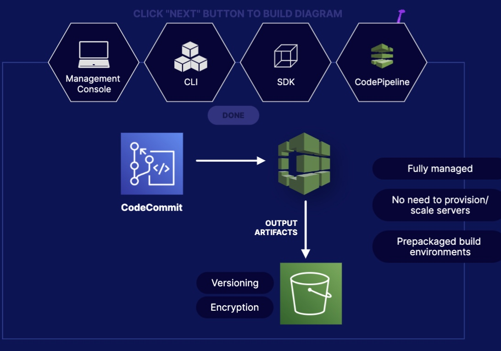
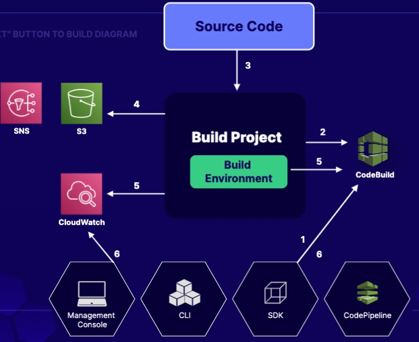
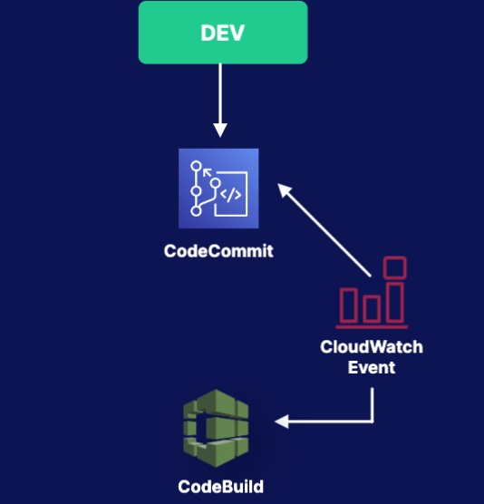
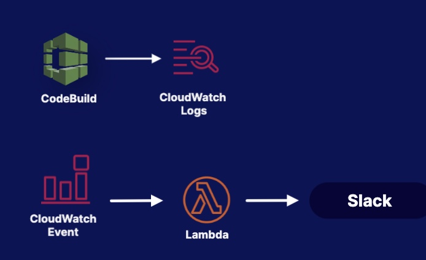

# CodeBuild
CodeBuild is a fully managed CI service that compiles source code, runs tests, and produce software packages that are ready to deploy

Key Factors:
- You must provide CodeBuild with a build project
- If there is any build output, the build environment uploads its output to S3.
- Such an output will become an input of the next step.

## How does CodeBuild Work

1. Provide with a build project
2. Use the Build project to create build environment
3. Download Source Code to the build environment
4. Send output of the build to S3
5. While a build is running, the build project can send information to CloudWatch or back to CodeBuild
6. Use preferred interface to get update

### Use Case 1:

Setup CloudWatch to monitor for mergers to CodeCommit and then trigger a build in CodeBuild

### Use Case 2:

- Send CodeBuild logs tp CloudWatch logs
- Set up a CloudWatch event to monitoring for new logs
- Trigger a lambda function to send a notification to slack 
