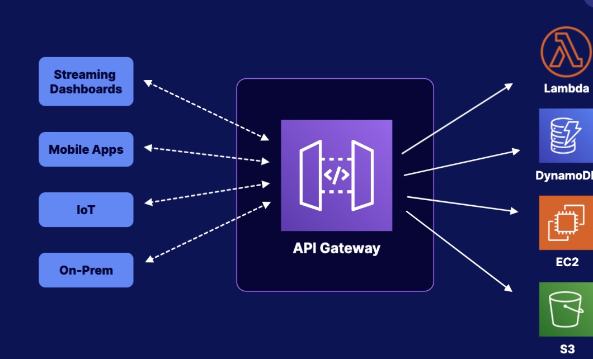
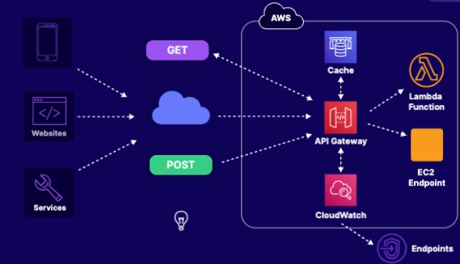
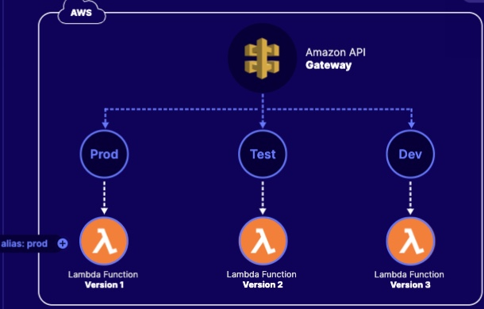

# API Gateway
API Gateway is a AWS service, that allow you to create, publish, maintain, monitor, secure your REST or Web Socket API

## How does API Gateway Work?
Once the app or client gains access to the website or service through API gateway, they can use HTTP `GET` or `POST` methods to access the backend data store

## REST API vs Web Socket API
A REST API receives messages from the client and forwards those to the backend resource. 

A WebSocket API supports `2-way communication`. The backend services can independently send messages to their clients. It means the WebSocket API does support a realtime communication.

## API Gateway with Lambda
API Gateway can reference both Lambda Versioning and Alias
