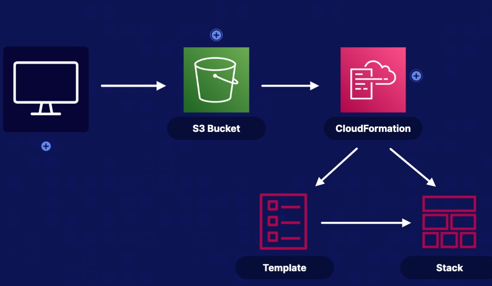

# CloudFormation
## What is CloudFormation
CloudFormation is an Infrastructure as Code Service. It can use a single template or multiple templates to create an environment or interactive with other tools

## Essentials
- Developer create infrastructure as code (json or yaml)
- Save the template in S3
- Use CloudFormation to create a stack from the template

## CloudFormation Template
A declaration of the AWS resources that make up a stack.
The resources section is the only required section in a template
Store a template in a different region, in case of diaster recovery needed

## CloudFormation Intrinsic Functions
Intrinsic functions are built-in CloudFormation functions, which allow you to dynamically assign values to properties at the `runtime`
For instance, we can use intrinsic function to retrieve a public ip address of EC2 at runtime in the same stack