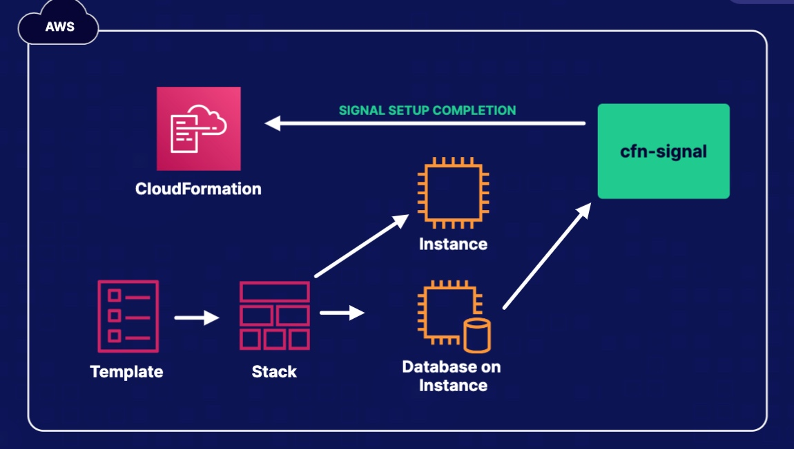

# CloudFormation
## What is CloudFormation
CloudFormation is an Infrastructure as Code Service. It can use a single template or multiple templates to create an environment or interactive with other tools

## Essentials
- Developer create infrastructure as code (json or yaml)
- Save the template in S3
- Use CloudFormation to create a stack from the template

## Template
A declaration of the AWS resources that make up a stack.
The resources section is the only required section in a template
Store a template in a different region, in case of diaster recovery needed

## Intrinsic Functions
Intrinsic functions are built-in CloudFormation functions, which allow you to dynamically assign values to properties at the `runtime`
For instance, we can use intrinsic function to retrieve a public ip address of EC2 at runtime in the same stack

## Wait Conditions and Creation Policies
1. Wait Conditions pause the execution of stack creation, and wait for a number of success signals, for a specific period of time.

Typical use cases
- To coordinate stack resource creation with configuration actions that are external to the stack (hybrid scenario)
- Wait for an RDS database to be configured
- Wait for a NAT instance to be configured before private insurances attempt to access the internet

2. Similar to wait conditions, the creation policies pause the creation of stack, until the desired number of succeed single has received.