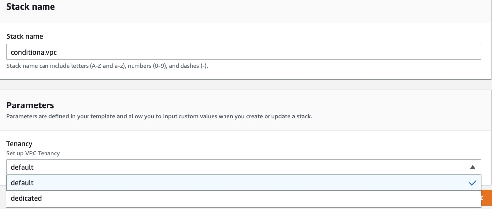

# Working with CloudFormation Condition Functions
## Create a VPC with Dedicated Tenancy
1. Create a stack using this template [Lab1_VPC.json](./Lab1_VPC.yml)
2. Verify the dedicated VPC resources 

## Create a VPC with Default Tenancy
1. Create a stack using this template [Lab1_VPC.json](./vpctenancy.yml)
2. You will see the option list here when creating the stack

3. Verify the dedicated VPC resources 