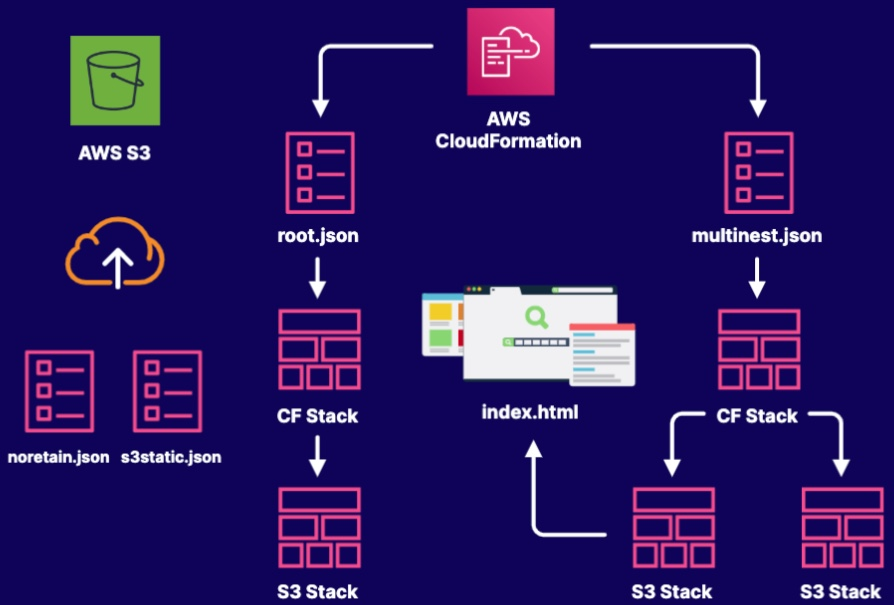

# Working with CloudFormation Nested Stacks
## Objectives
- Create an S3 Bucket and Upload CloudFormation Templates
- Create a Nested Stack with a Single Child Stack
- Create a Nested Stack with a Multiple Child Stacks
- Upload the index.html file and verify the page loads

## Solution
1. Create an s3 bucket, then upload the `s3static.json` and `noretain.json` CloudFormation template

2. Create a nested CloudFormation Stack using the `root.json` template

3. Create a nested CloudFormation Stack using the `multinest.json` template

4. Find out the s3 bucket name, upload the index.html file and verify the page loads
