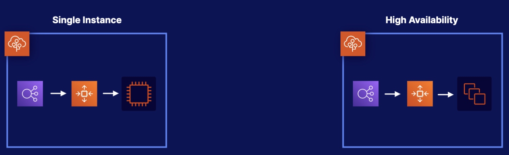
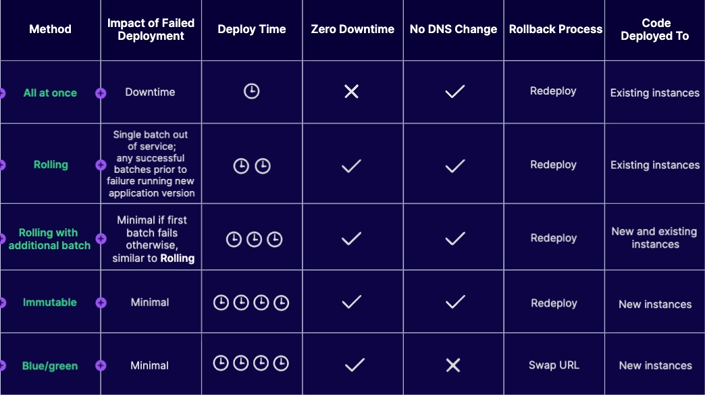

# Deployment Strategy
## Environment Types

Single Instance:
* Load balancer
* Auto scaling group: always keep one single instance,  Elastic IP address

High Availability:
* Load balancer
* Auto scaling group: provide a group of instances

## Deployment Methods

