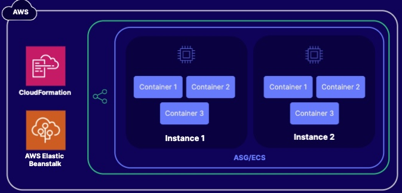

# Environment Configuration

Elastic Beanstalk can be created within a CloudFormation template

There are three configuration options:
1. Configuration Files
2. Saved Configuration
3. Direct changes

## Docker Deployments
Q: Our Software Development team wants easy deployment of applications. 
A: Elastic Beanstalk

Q: We're now using Elastic Beanstalk. But we're having problems because team members are widely dispersed and are having problems with environment disparity across different machines and platforms.
A: Docker containers with Elastic Beanstalk!

Q. But our application has  multiple processes and we want to ensure scalability.
A: We should follow best practices and deploy 1 container per process by using the multi-container deployment approach.

