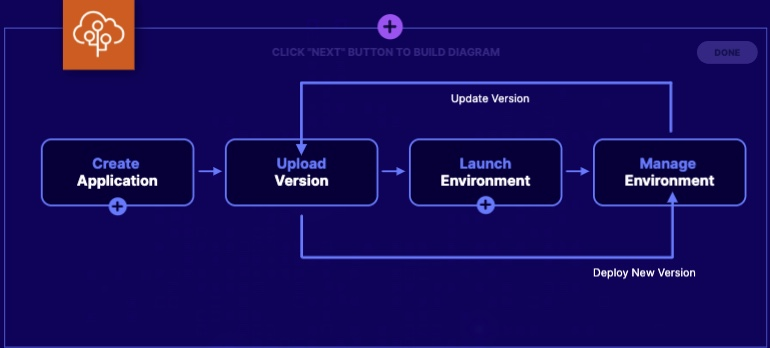

# Overview
The elastic beanstalk will help us quickly build up an application, without worrying about what the environment this application will need to run

We just need to upload the application, the elastic beanstalk will handle:
- capacity provisioning
- load balancing

## vs AWS OpsWorks and CloudFormation
AWS Product|Key Strength|Typical Use Case|
-------|---|----------|
Elastic Beanstalk|Simple to use. Deal with application|Developer for testing
OpsWorks|Compatible wit Chef an Puppet|Hybrid environment|
CloudFormation|Deal with infrastructure|DevOps|