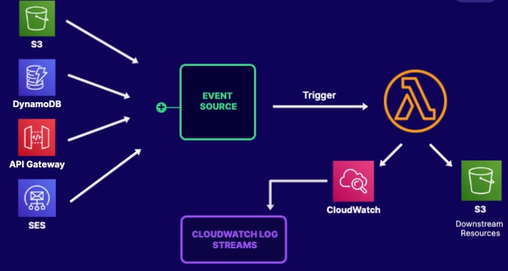
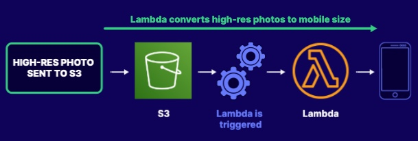
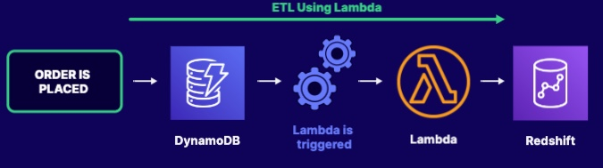

# Overview
## Key Point
Lambda is 
1. Serverless
- Allows you to run code without having to provisioning servers
- We are only charged, when the codes are running.
2. Stateless
- Does not hold any state
3. Event-driven
- Need something to trigger the lambda and move to actions

## Lambda Requirements
1. The lambda Function (code and deployment package)
2. Memory Size Specifications
3. Execution Time (up to 15 minutes)
4. IAM Role (The Execution role)
5. Event Source Mapping

## Use Case
1. Automatically convert the high-resolution photos to low-resolution photos

2. ETL

