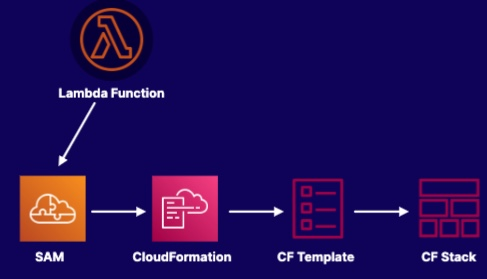

# SAM Framework
SAM (Serverless Application Model) acts as the bridge between `Lambda` and `CloudFormation`

- Open source framework for building serverless applications
- A CloudFormation extension optimized for serverless application
- Using the Transform Function, we can include SAM code in CF templates

Some Factors:
- SAM Syntax is yml, the same to CloudFormation
- SAM is free, the charge will be on resources created
- SAM CLI