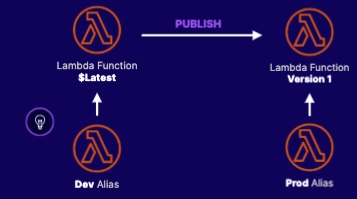
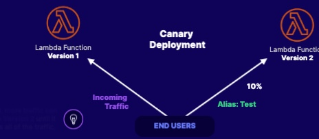
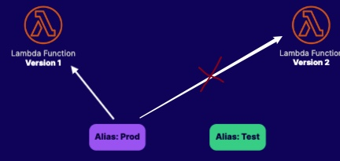

# Versions and Aliases

## Version
You can publish one or more verison of lambda function
Each lambda function has a unique `ARN`
Once published, the version can not be changed

## Aliases
Alias is a pointer to lambda functions
The alias can be moved around to point to a specific lambda function

## Use Case
1. Test a new version
- Point `alias:test` to version to take only 10% of the traffic
- If the testing goes well, we can direct more traffic to version 2
- Eventually, we can point `alias:prod` to version 2

2. No downtime with rapid rollback
- Point `alias:prod` to version 2 once testing is complete
- If problems in version 2 arise, we can quickly point `alias:prod` back to version to avoid downtime.
