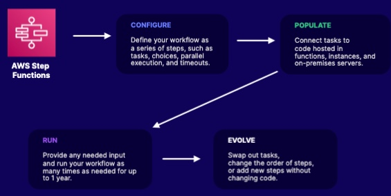

# Overview
A `State machine` is a collection of states
A `Step function` is a implementation of state machines.

## Workflow
- Configure
- Populate
- Run
- Evolve

## Use Cases
1. Processes that extend beyond 15-minutes life of a lambda function
2. Business Process
3. Parallel execution of lambda functions