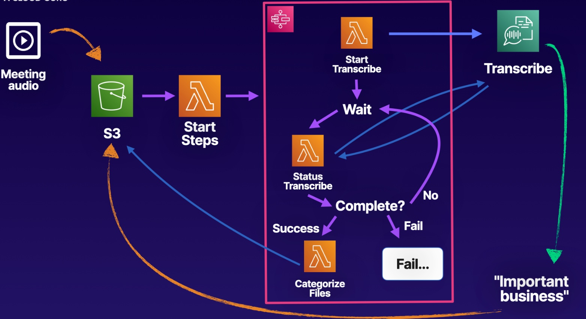
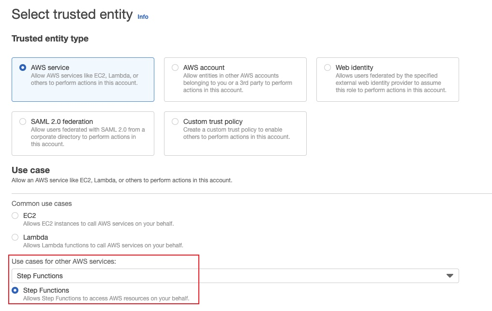
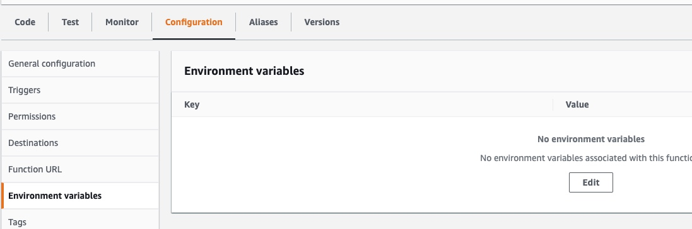

# Categorizing Uploaded Data Using AWS Step Functions
In this labe, our task is to build a pipeline that can take in all of this audio and translate it to text. 
- We then need to check the transcript to see if it contains any of the secret project names. 
- Normal audio gets put into the standard "processed" folder, 
- Audio containing secret projects needs to be put in the "important" folder.

## Solution
### Prepare to Launch the Step Function
1. Create an IAM role to allow Step Functions to start Lambda functions.

2. Create a Step Function
- Click the `Create state machine` button.
- Select `Author with code snippets`.
- name: `Categorize-Audio-Data-Pipeline`
- Click Choose an existing role and make sure the role is the one that we just created.
- Tag: key = `app`, value =  `meeting-transcriber`
3. Update Lambda and S3 to Work with Step Functions
**lambda**: add environment variable
- key: `STATEMACHINEARN` 
- value: `our state machine's ARN`

**s3**: create event notification
- name: 'trigger-audio-processing-event'
- Prefix: 'upload/'
- Suffix - '.mp3'
- Select the checkbox next to 'All object create events'.
- In the dropdown menu under Lambda function, select the `run-step-functions-lambda` function that we just created.

### Create the Step Function Flow

### Create the Lambda Business Logic

### Categorize Audio Data