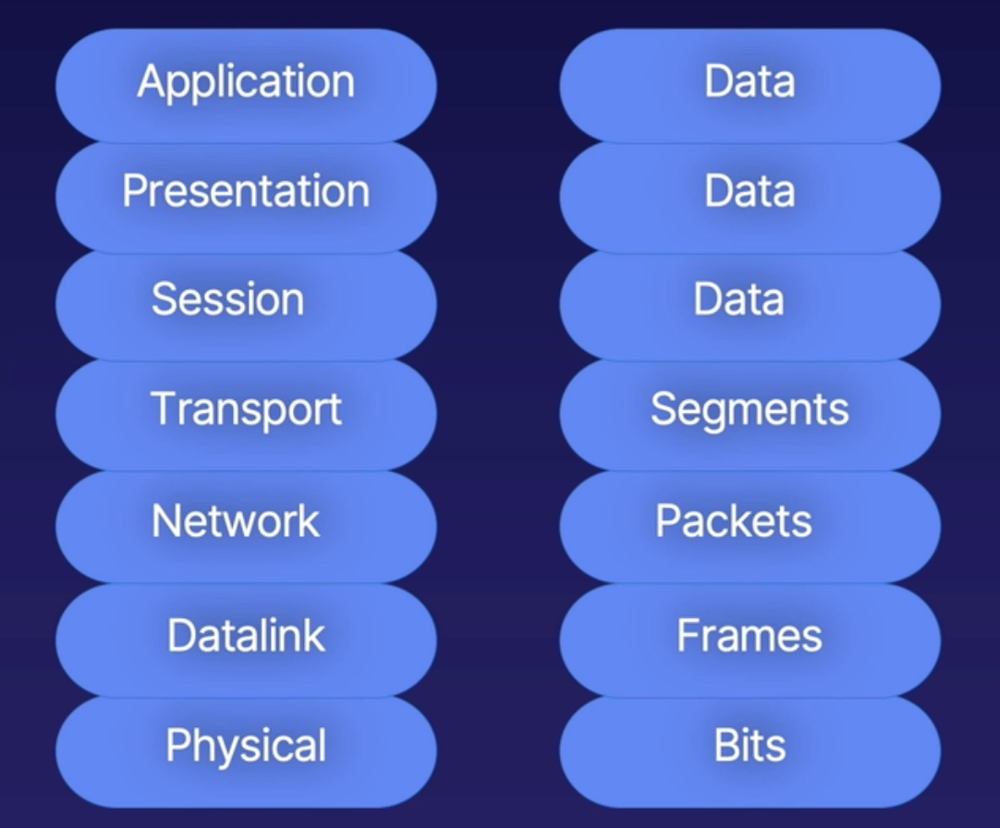
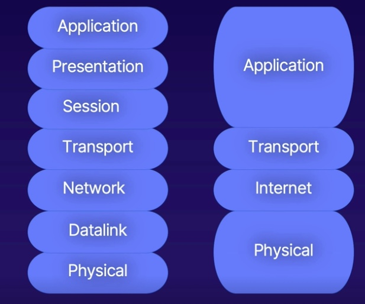
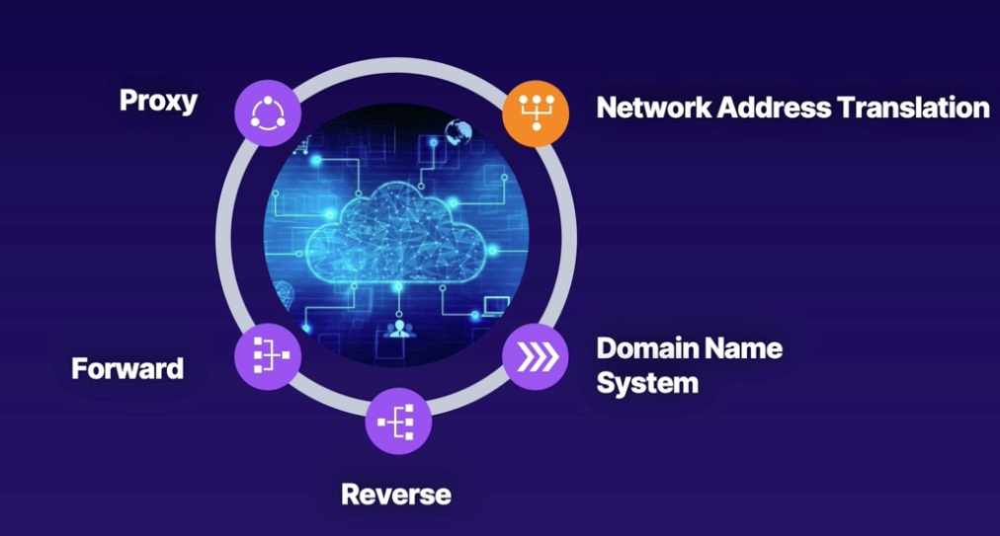
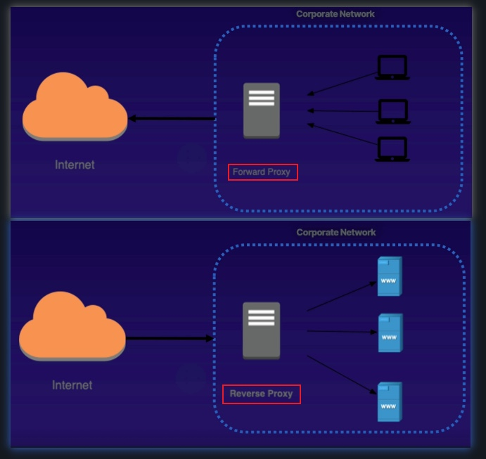
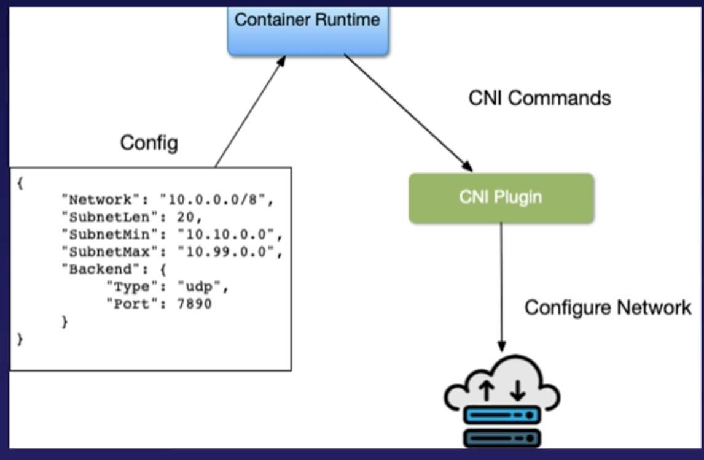

# README
## OSI vs TPC/IP model
OSI Model

OSI vs TCP/IP

## Network Terms Overviews:
1. Loading balancing in different layers:
* `Layer 3` load balancing: refers to the ip address stored in the header of the packet
* `Layer 4` load balancing: be able to route traffic based on both the ip address and TCP/UDP port numbers
* `Layer 7` load balancing: make routing decisions based on HTTP headers, host or URI

## Terminologies:
1. Datagram: distinct unit of data
2. Socket: Combination of Port and IP
3. Packet: layer 3 datagrams
4. Port: Layer 4 data identifier

## Who you talking To

1. Proxy: An intermediary system that complete the request and retuen the results

2. DNS(Domain Name System): Translate IP address to human readable address
3. NAT(Network Address Translation): An IP level mapping to translate one address into another

## Container Networking:
1. `Encapsulation`: the process of wrapping data in an additional layer
2. `Overlay`: a virtual, logic network built on top of an existing network
3. `VxLAN`: A protocol used to create an overlay network
4. `Service Mesh`: decouple the underline infrastructure of the application from the network architecture. discover and connect services

## Kubernetes networking model
1. Communication Issues to solve by container networking:
* Container to Container
* Pod to Pod 
* Pod to Service
* External to Service

2. CNI (Container Network Interface): Interface between container runtime and network implementation
* cilium
* flannel
* calico

3. AWS VPC CNI
* HA
* Low Latency
* Minimal Network Jitter
* Apply VPC Best Practices: VPC Flow logs, VPC Routing Policies, Security Groups
