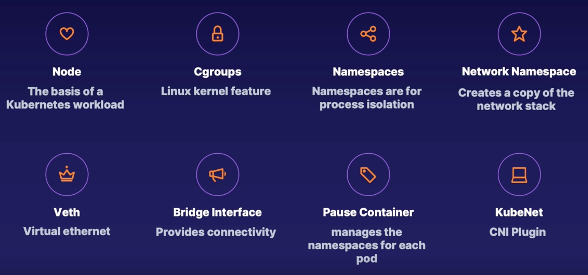
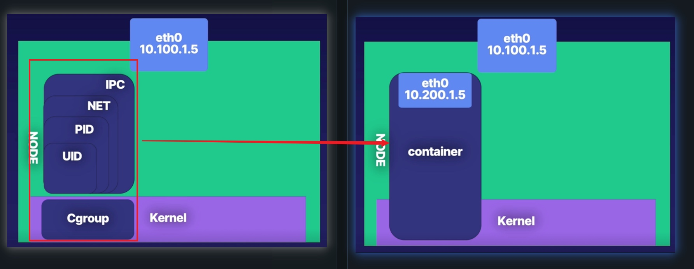
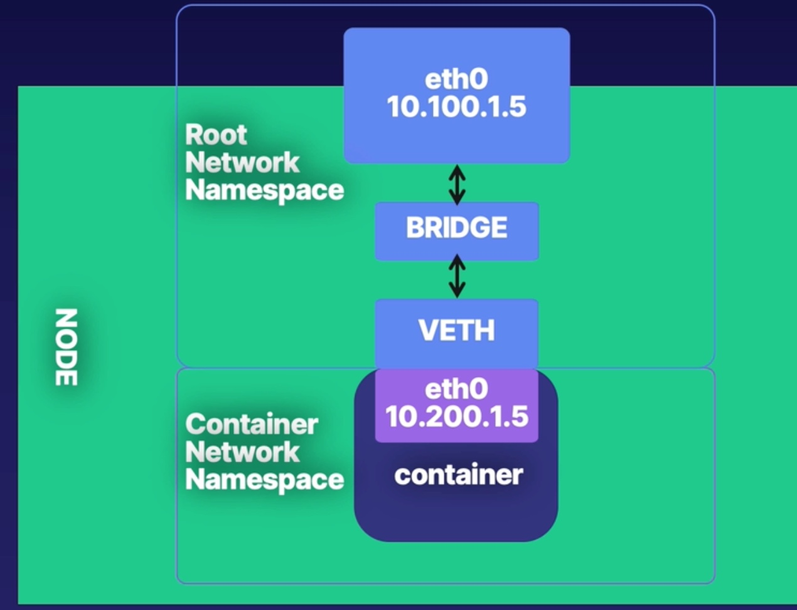
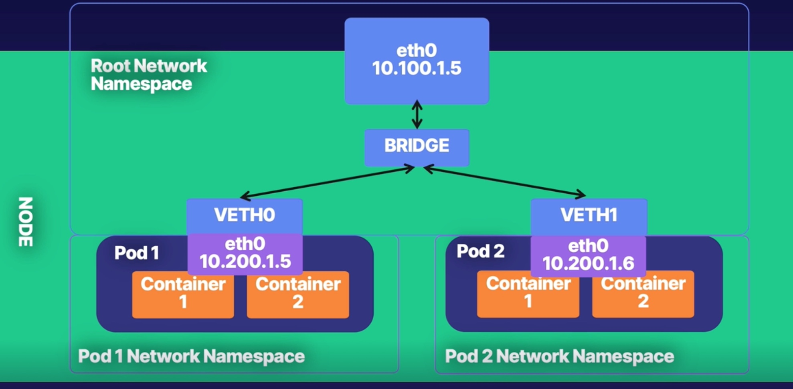
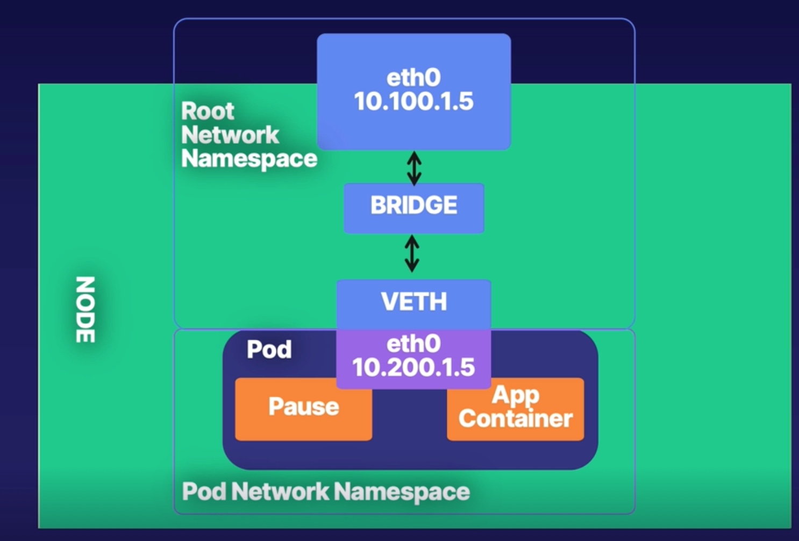
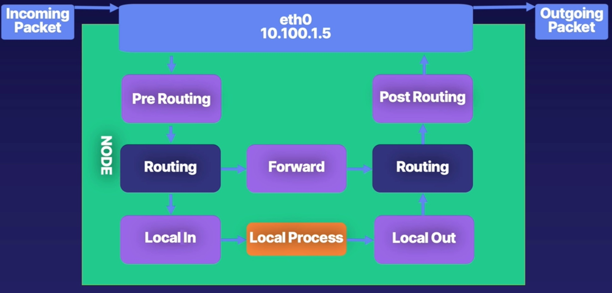
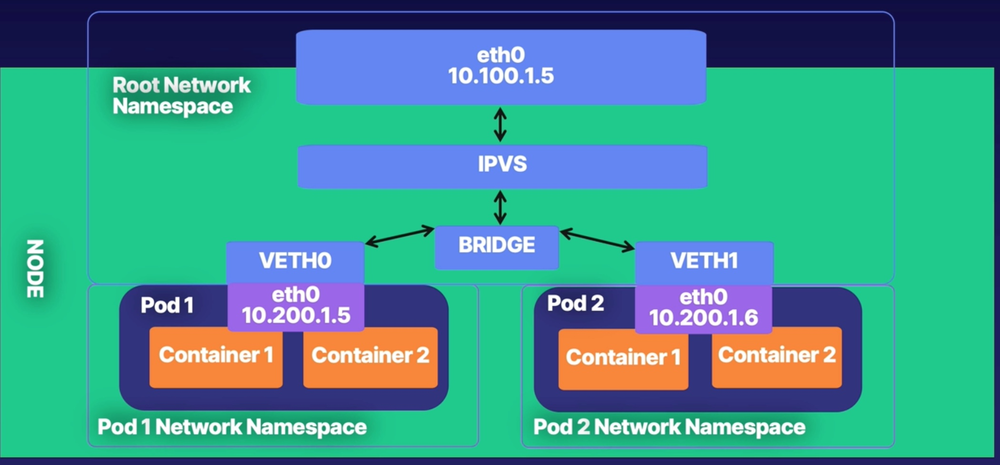

# Index
1. Background
2. Container Networking
3. Kubernetes Networking
4. Accessing the cluster network
5. AWS networking and kubernetes 

# Container Networking
## Networking primitives

1. What is a container?
    * `Cgroups` controls how much resource a process is using
    * `Namespaces` offers process isolation
    * `Container `is the combination of Cgroup and Namespaces

2. How to provide the container with the network connectivity?
    * `Veth`(Virtual ethernet): A simple tunnel driver to connect the root network namespcae with the container network namespace
    * `Bridge`: Get the root namespace to handle the container packets

    * Each container in the pod share the pod network namespace, so that they can communicate over the local host
    * Each pod on the node also connect to the same bridge

3. Pause container
    * A parent container of all containers in the pod
    * Manage the namespace for each pod
    * This is why the namespace retains while the app in the pod is dead

## IPtable
5 hooks: pre routing, local in, local out, forward, post routing

IPtable contains 3 components
* rules: what to do with a packet
* chains: groups of rules
* tables: groups of chains

## IPVS (IP Virtual Server)

IPVS is A layer 4 switch. 
* Implement transport layer load balancing in a linux kernel
* Direct requests for TCP or UDP based services

IPVS supporting 3 load balancing mode
* NAT
* Direct Routing
* IP Tunnelling