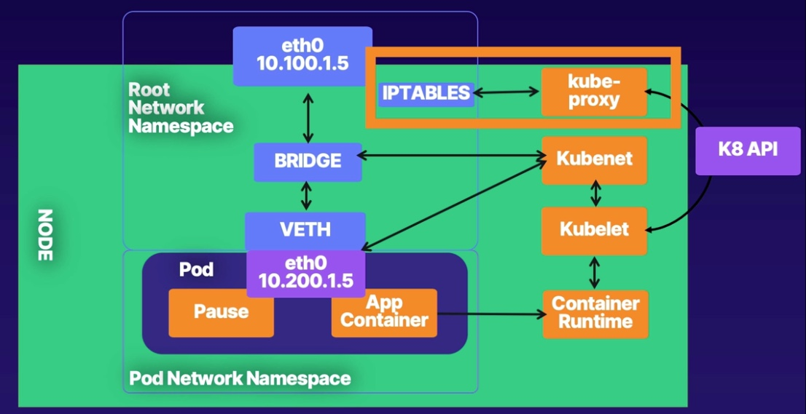
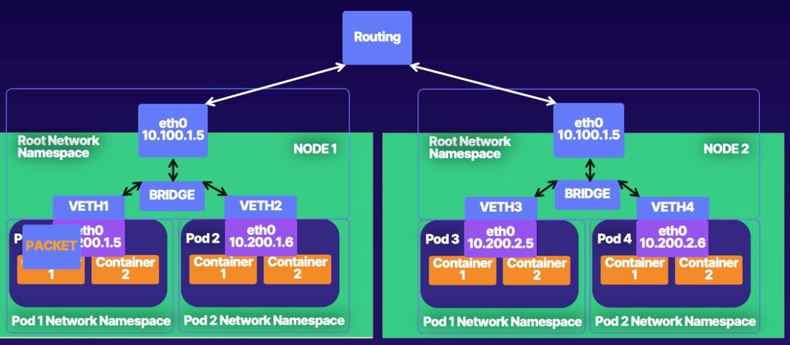

# Index
1. Background
2. Container Networking
3. Kubernetes Networking
4. Accessing the cluster network
5. AWS networking and kubernetes 

# Kubernetes Networking
## kube-proxy

There are 3 Kube-proxy modes
1. Userspace
2. Iptable
3. IPVS

## Routing in the cluster
Kubernetes Networking
1. Host Network: Good old-fashioned networking
2. Service Network: Virtual IPs implemented in iptables
3. Pod Network: All pods must have a unique IP per kubernetes model

## Overlay Networking

## Network Policy

## Kube-DNS
