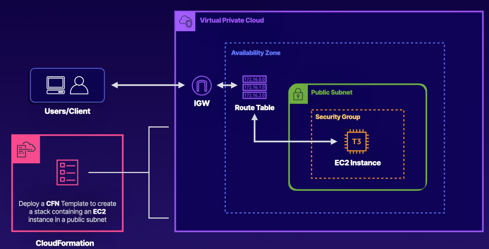
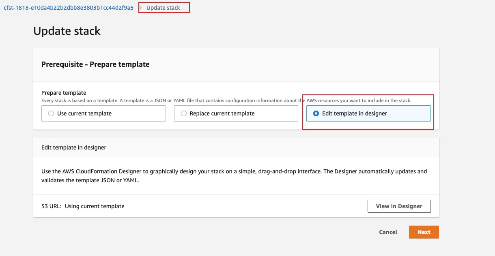

# Deploying a Basic Infrastructure Using CloudFormation Templates
## Introduction

## Solution
### Using CloudFormation Designer, Configure the InstanceType Stack Parameter to T3.Micro
1. Select the stack already in the CloudFormation dashboard.
2. Update the parameters

update the Instance Type block
`Default: t3.micro`

Here you can find more templates
[aws-cloudformation-templates](https://github.com/awslabs/aws-cloudformation-templates/tree/master/aws)
