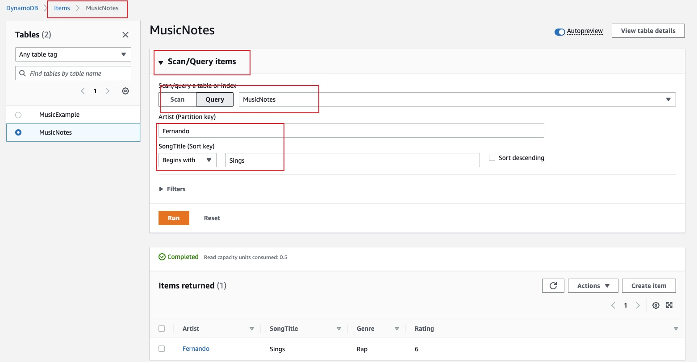

# AWS DynamoDB in the Console - Creating Tables, Items, and Indexes
## Introduction
This lab provides you with essential exposure to database concepts such as 
* Partition and sort keys, 
* How to add, delete, and update items, 
* The attributes inside of a DynamoDB table. 
You will also add local and global secondary indexes, and use the local secondary index to query for items in your table.

## Solution
### Create a DynamoDB Table
1. Navigate to the DynamoDB console. Click `Create table`, and set the following values in the Table details section:
* Table name: Enter MusicNotes.
* Partition key: Enter Artist, and select String.
* Sort Key: Enter SongTitle, and select String.

2. In the Settings section, select Customize settings. In the Read/Write capacity settings section, set the following values:
* Capacity mode: Provisioned
* Read Capacity Auto Scaling: Off
* Read Provisioned capacity units: 1
* Write Capacity Auto Scaling: Off
* Write Provisioned capacity units: 1

3. Click on Create `local index` in the Secondary indexes section. Be informed you can only create local secondary index when initiating the table.
* Sort key: Rating, Number
* Index name: Artist-Rating-index
* Attribute projections: All

### Creating Items
1. Select the MusicNotes table. Click on Create item
* Artist: Fernando
* SongTitle: Sings
* Click Add new attribute > Number. Rating: 6.
* Click Add new attribute > String. Genre: Rap

### Creating a Global Secondary Index
In the Create global secondary index dialog, set the following values:
* Partition key: Genre, String
* Sort key: Rating, Number
* Index name: Genre-Rating-index

### Query a DynamoDB Table
* Query the table

* Query the local secondary index (Rating)

* Query the global secondary index (Genre and Rating)a 
