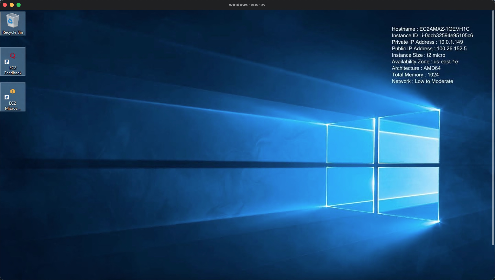

# Create a Windows EC2 Instance and Connect using Remote Desktop Protocol (RDP)
## Introduction


## Solution
### 1. Verify the VPC, Subnet, RT, NACL

### 2. Create New Security Group and Allow Inbound RDP Traffic into It

Create a specific security group with inbound rule:
* Type: RDP
* Protocol: TCP
* Port Range: 3389
* Source: Custom 0.0.0.0/0
* Description: RDP ACCESS

### 3. Create a Windows EC2 Instance

1. Download remote desktop file and import to RDP client
2. Use get password to decrypt the key pair:
```
K*LxzZ1n8pV5y(T-Sbos!rvz4eNvACl;
```
3. There you go
