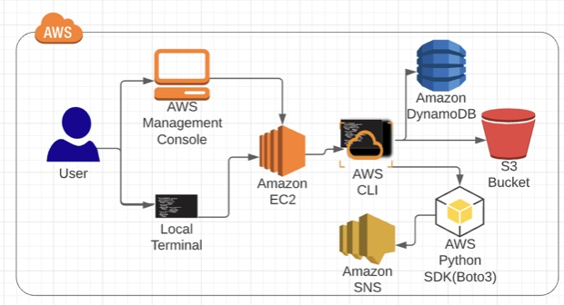

# Creating Your Own EC2 Workstation in the AWS Console

## Introduction
Create EC2 workstation in the AWS console. This will be a useful skill whenever you find yourself working in an AWS environment. Not only will you learn some of the nuances of creating EC2 instances through this process, you'll also be able to do this again in your own AWS environment to create your own AWS workstation that is free from the clutter of a local machine. By the end of this hands-on lab, we will have created our own EC2 instance and signed into it with an SSH key. We will also have used that instance to create an S3 Bucket in our AWS account and used the instance to have the Simple Notification Service send us a text message.


## Solution
### Create an EC2 Instance
1. Select Amazon Linux 2 AMI.
2. Change the IAM role to the lab-provided `EC2InstanceCDALabRole` and click Next: Add Storage.
3. Click Next: Configure Security Group.
4. When presented with the key pair dialogue, select Create a new key pair from the list. Give the key pair a name and click Download Key Pair. Take note of the location of the .pem file when it is downloaded.
5. Using a local terminal application, modify the permissions for the key pair:
```bash
# before permission change
ls -ltr my_key.pem 
-rw-r--r--@ 1 evan  staff  1678 13 Sep 11:03 my_key.pem
# change permission. Note: You must be in the same directory as the .pem file when running the above command.
chmod 400 my_key.pem
# after permission change 
ls -ltr my_key.pem 
-r--------@ 1 evan  staff  1678 13 Sep 11:03 my_key.pem

# ssh to the vm
ssh ec2-user@54.144.242.146 -i my_key.pem 
```
## Use the EC2 Instance to Create an S3 Bucket with the AWS CLI and Send a Message with SNS
1. Configure the AWS CLI by running the following command:
```bash
aws configure

AWS Access Key ID [None]:
AWS Secret Access Key [None]:
Default region name [None]: us-east-1
Default output format [None]:
```

2. Once configured, attempt to list the dynamodb tables again:
```bash
aws dynamodb list-tables
```

3. Using the AWS CLI, create a new s3 bucket:
```bash
# create
aws s3 mb s3://<BUCKET-NAME-123456>
# verify
aws s3 ls
```

4. Using the following command, install python-pip:
```bash
sudo yum -y install python-pip
# install boto 3
sudo pip install boto3

sns = boto3.client('sns')
phone_number='61430792115'

sns.publish(Message='Hello from A Cloud Guru',PhoneNumber=phone_number)
```