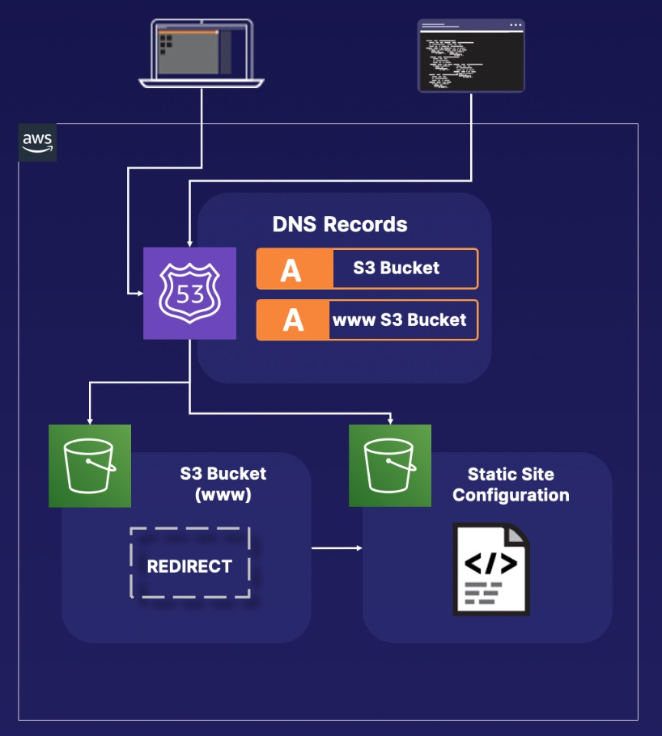
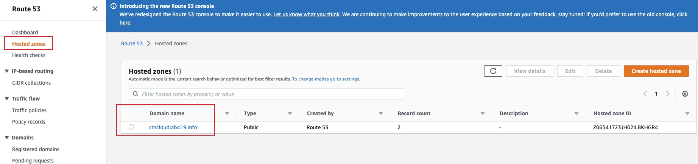
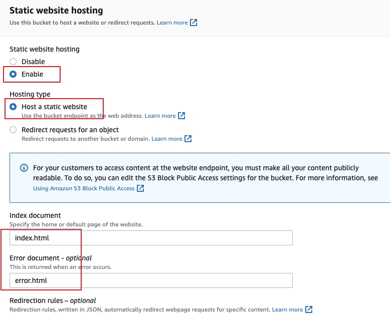
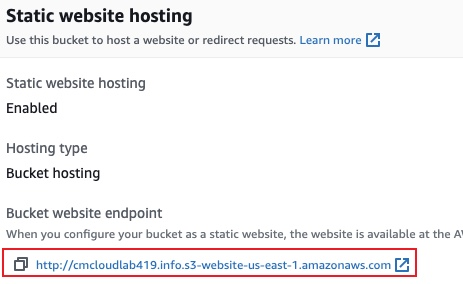
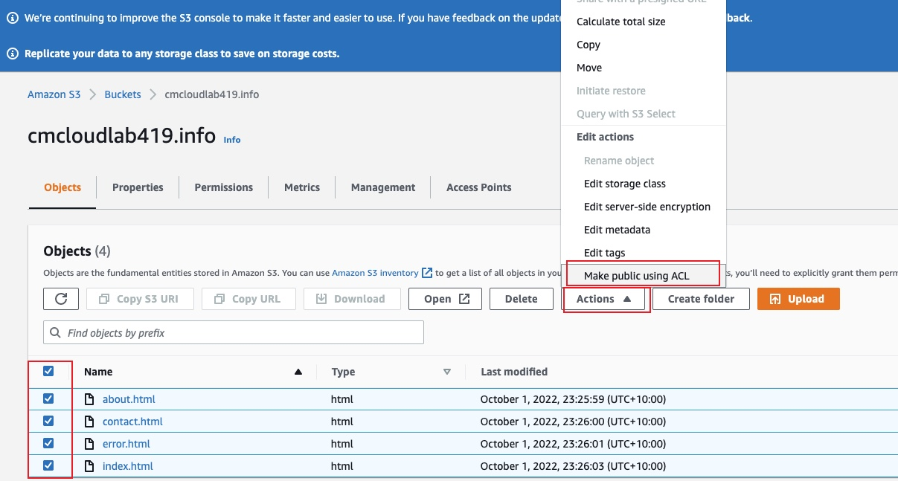
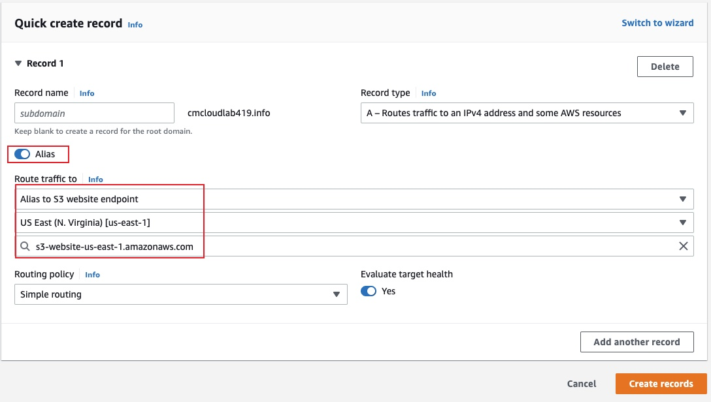
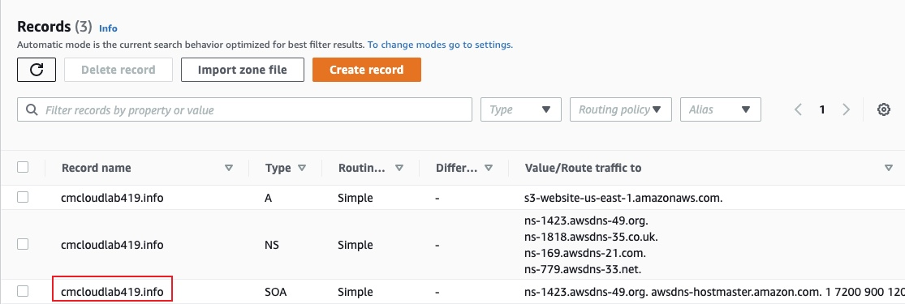
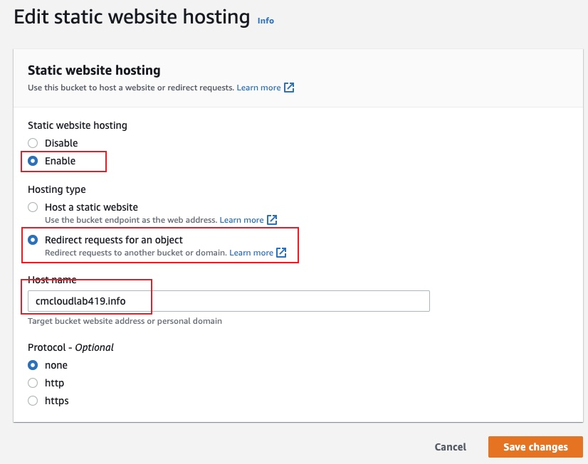
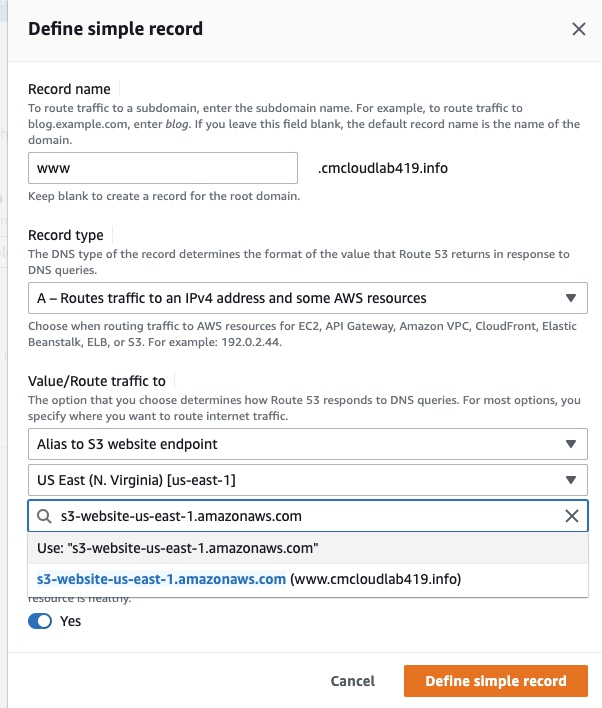

# Configuring Amazon S3 Buckets to Host a Static Website with a Custom Domain
## Introduction
Create and configure a simple static website. 
Configure that static website with a custom domain, using Route 53 Alias record sets. 
This lab demonstrates how to create cost-efficient website hosting for sites that consist of files like HTML, CSS, JavaScript, fonts, and images.

## Solution
### Create an S3 Bucket and a Static Website
####  Create an S3 Bucket and 
1. find the domain name from route 53

2. Create a new S3 bucket. 
* The bucket name must match your domain name exactly when setting up a static website using S3 and Route 53.
* Check `ACLs enabled`
* Uncheck `Block all public access`

#### Create a Static Website
1. Upload html files.
2. Select the `Properties` tab, Edit the `Static website hosting` section.

3. Find the static website endpoint here. 

4. Once click the link, there is an error which indicates either that there is an error within our S3 bucket or our HTML files are not public. Make these html public using ACL can fix this error

#### Configure a DNS Record for the S3 Bucket
1. In Route 53, select the `host zone link`  and click `Create Record`.

2. The static web can be access via its domain name

  
### Configure a Custom Domain in Route 53
#### Create a Redirect S3 Bucket
1. Create a new S3 bucket.
* use www.[previous bucket name] as the new bucket name
* Uncheck Block all public access
2. Edit the `Static website hosting` of the redirect bucket

#### Configure a DNS Record for the Redirect S3 Bucket
1. Use Wizard ti add a simple route to the redirect S3 bucket

