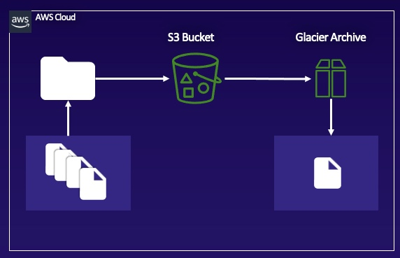

# Creating a Basic Amazon S3 Lifecycle Policy
## Introduction

## Solution
### Create an S3 Bucket and Upload an Object

1. Navigate to S3.
2. Click Create bucket.
3. In Bucket name, enter a globally unique name.
4. Deselect Block all public access.
5. Click I acknowledge that the current settings might result in the bucket and the 6. objects within becoming public.
6. Click Create bucket.
7. Click the bucket to open it and click Upload.
8. Click Add folder.
9. Select the ccp-master folder downloaded from GitHub.
10. Click Upload > Upload.
11. At the bottom of the page, click Upload.

### Create a Lifecycle Policy
1. Return to the main page of the S3 bucket.
2. Select the Management tab.
3. Scroll to Lifecycle rules and click Create lifecycle rule.
4. In Lifecycle rule name, enter "sample-s3-to-glacier-rule".
5. Scroll to Filter type and in Prefix enter "pinehead".
6. In Lifecycle rule actions, click Transition current versions of objects between storage classes and Transition previous versions of objects between storage classes.
7. In Transition current versions of objects between storage classes, select Glacier from the dropdown and set Days after object creation to "30".
8. Click I acknowledge that this lifecycle rule will increase the one-time lifecycle request cost if it transitions small objects.
9. In Transition previous versions of objects between storage classes, select Glacier Deep Archive from the dropdown and set Days after objects become noncurrent to "15".
10. Click I acknowledge that this lifecycle rule will increase the one-time lifecycle request cost if it transitions small objects.
11. Click Create rule.
