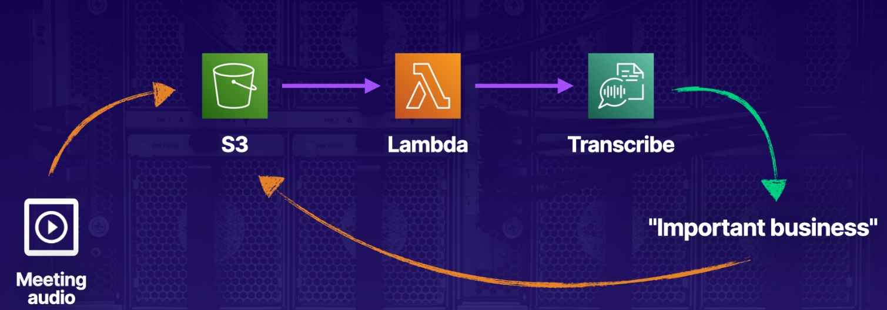
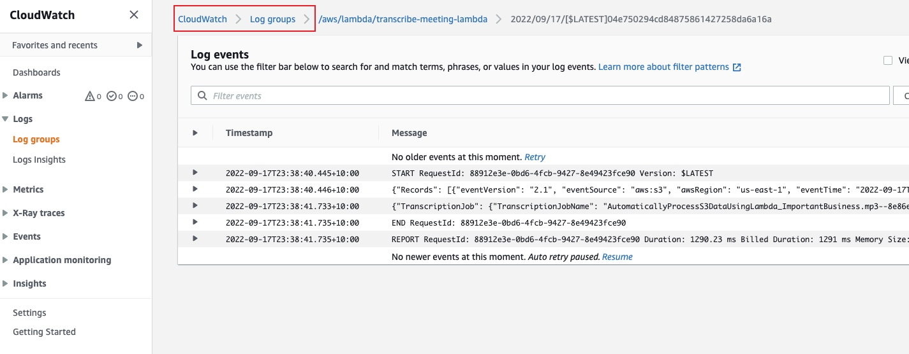
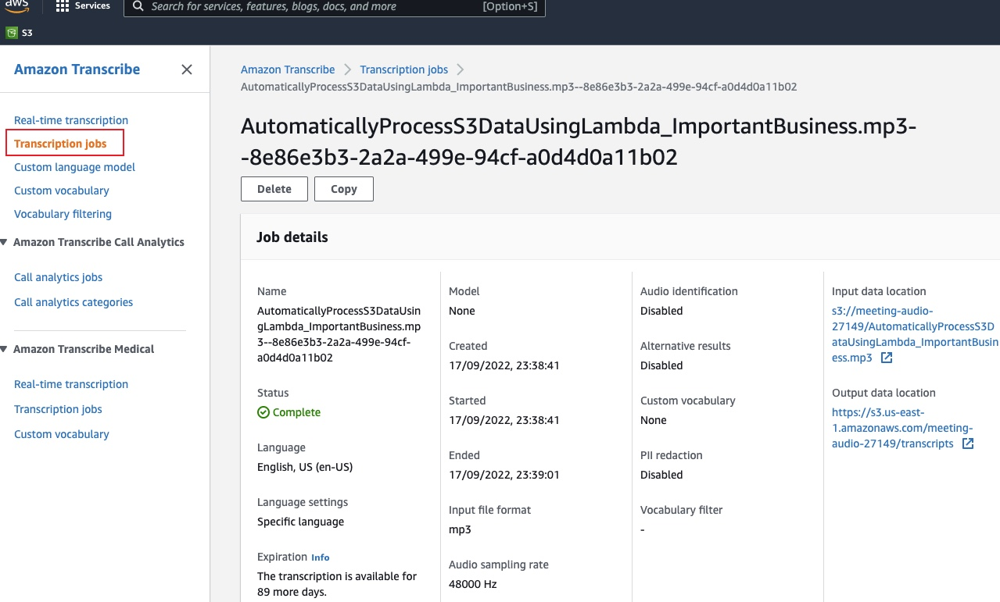

# Automatically Processing Data in S3 Using Lambda
In this lab, we'll transcribe audio data into text whenever an audio file is uploaded to S3. Magic!


## Solution
### Create an IAM Role
1. Under Choose a use case, select `Lambda`.
2. Grant these permissions.
```
AmazonS3FullAccess
AmazonTranscribeFullAccess
CloudWatchFullAccess
```
3. In Role name, enter `transcribe-meeting-role`.
### Create a Lambda Function
1. Select the option `Author from scratch`
2. Runtime: python 3.8
3. Click `Change default execution role`, then select `Use existing role` and choose `transcribe-meeting-role` from the dropdown menu.

### Create an S3 Bucket
1. Create a bucket named `meeting-audio-xxxxx`
2. Select `Block all public access`
3. Enter "app" under Key and "meeting-transcriber" under Value.
4. Under Default encryption, select `Enable for Server-side encryption` and leave the Encryption key type at the default of `Amazon S3 key (SSE-S3)`.
4. After the bucket creation, Click the `Properties` tab, then click `Create event notification`, to trigger lambda function when we upload to s3
    * In Event Types, select `All object create events`.
    * In the Lambda function dropdown menu, select `transcribe-meeting-lambda`.

## Automatically Transcribe Data
1. Upload a .mp3 file to the s3 bucket
2. View Cloud Watch Logs

3. View Transcription
