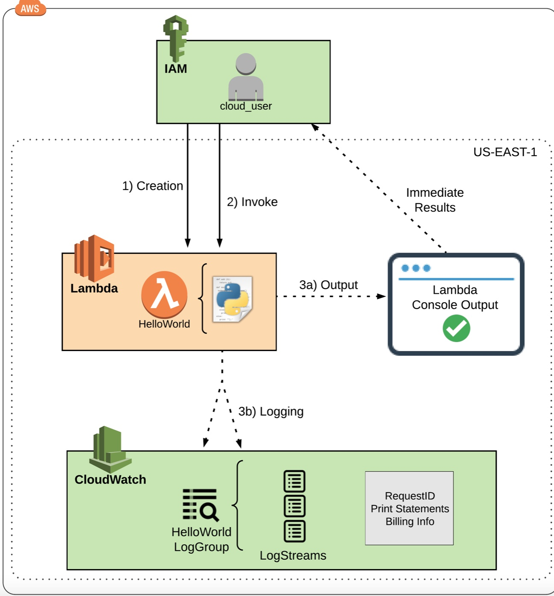

# Creating a Simple AWS Lambda Function
## Introduction
This Learning Activity provides hands-on experience with creating and customizing Python3-based Lambda functions from within the console.

The primary focus will be on the following features within AWS Lambda:
* Lambda Console
* Function Code
* Execution Roles
* Test Events
* Execution Results
AWS Lambda allows you to create functions and you only have to worry about managing your code. AWS handles the underlying infrastructure for you.
This HelloWorld function will allow you to see just how easy it is to get started.



## Solution
### Create a Lambda Function within the AWS Lambda Console
1. Navigate to Lambda.
2. Click Create a function.
3. Make sure the Author from scratch option at the top is selected, and then use the following settings:
* Basic information:
    * Name: HelloWorld
    * Runtime: Python3.6
* Permissions:
    * Select Choose or create an execution role.
    * Execution role: Use an existing role
    * Existing role: lambdarole
4. Click Create function.
5. On the HelloWorld page, scroll to the Function code section.
6. Delete the existing code there, and enter the code from GitHub.
```python
import json

print('Loading your function')

def lambda_handler(event, context):
    #print("Received event: " + json.dumps(event, indent=2))
    # print statements actually get printed to the logs.
    print("message --> " + event['message'])

    # Actually returning the value of the 'message' key.
    return event['message']

    # Raising an exception if something goes wrong...
    raise Exception('Something went wrong!')
```
7. Click Deploy.

### Create a Test Event and Manually Invoke the Function Using the Test Event
1. In the dropdown next to Test at the top of the Lambda console, select Configure test events.
2. In the dialog, select Create new test event.
3. Select the Hello World event template.
4. Give it an event name (e.g., "Test").
5. Replace the current code there with the provided JSON code, and then click Create.
```json
{
  "message": "Congrats! Your first successful Lambda function! Oh....and 'Hello World!' ",
  "notmessage": "If this shows, it is broken!"
}
```
6. Click Test to verify the function's success.

### Verify That CloudWatch Has Captured Function Logs
1. Navigate to CloudWatch.
2. Select Logs in the left-hand menu.
3. Select the log group with your function name in it.
4. Select the log stream within the log group.
5. Verify the output is present and correct.