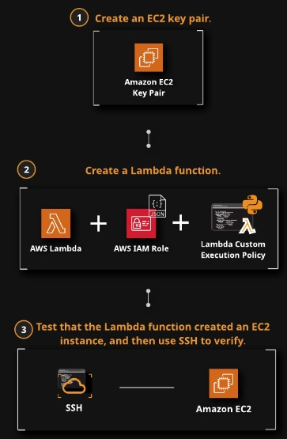
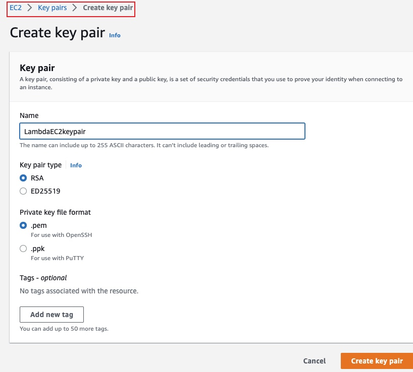
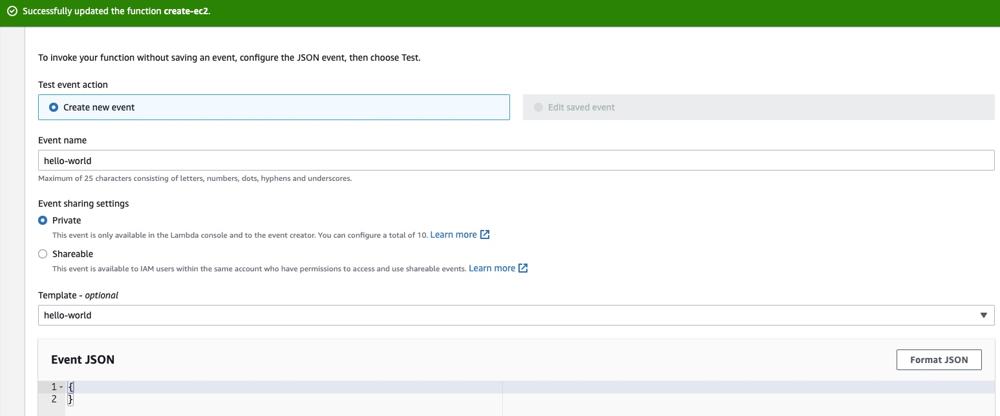

# Creating an EC2 Instance with Lambda in AWS
## Introduction
In this lan, we will
- Write a Lambda function to create an EC2 instance. 
- Create a custom Lambda execution policy for the IAM role. 

When we're done, we will be able to log in to the new EC2 instance via SSH.


## Solution
### Create EC2 Key Pair
We will need this key pair to access the newly create EC2 instance


### Create a Lambda Function
1. Choose `Author from scratch` and use the following settings:
- Name: CreateEC2
- Runtime: Python 3.7
- Role: Create a new role with basic Lambda permissions

2. Deploy this code [create-ec2.py](./create-ec2.py) and add required environment variable to make the code reusable.

3. Navigate to IAM Role and replace the policy that's currently attached to the role with this new policy [lambda-policy-ec2.json](./lambda-policy-ec2.json), which allows lambda to create EC2 instance

4. Define an empty test event. Its contents can simply be {}. Give it any name you like. Then lick Test. A new EC2 instance should be created


### Connect to the Instance via SSH
```bash
chmod 400 LambdaEC2keypair.cer

ssh -i LambdaEC2keypair.cer ec2-user@ec2-54-152-120-100.compute-1.amazonaws.com
```