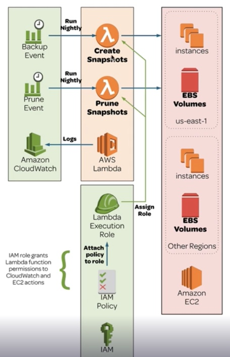

# Backing Up EC2 Instances

## Solution
1. Create a new iam role with this policy [iam.json](./iam.json) to allow lambda function to interactive with both EC2 and CloudWatch
2. Create a lambda function [create-back.py](./create-backup.py) to perform EBS backup
3. Create a lambda function [prune-back.py](./prune-backup.py) to retain only top 3 latest backups
4. Add two Cloud Watch rules to trigger the above two lambda function on schedule.
5. Verify the EBS snapshot creation and deletion