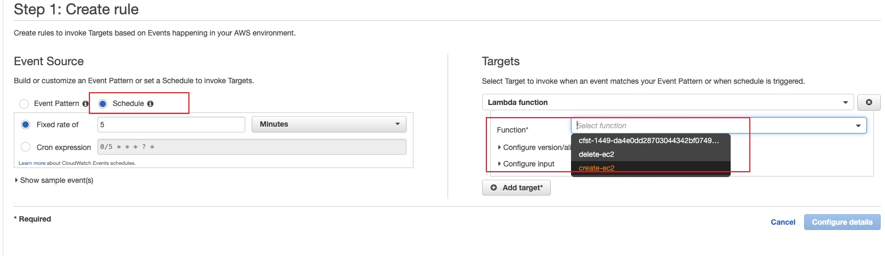

# Stopping EC2 Instances Nightly
## Introduction
- Create a lambda function that will be running on a CloudWatch Schedule. The lambda function will iterate through all regions to find and stop EC2 instances
- Grant the lambda function necessary privilege to talk to both CloudWatch and EC2

## Solution
1. Create a lambda function [delete-ec2.py](./delete-ec2.py)that will be running on a CloudWatch Schedule.
Increase the Timeout timer, based on the workload.

2. Grant the lambda function necessary privilege [iam.json](./iam.json)to talk to both CloudWatch and EC2
3. Add a Cloud Watch rule to trigger the lambda function on schedule.

4. Inspec Cloud Watch log for the list of EC2 deleted
