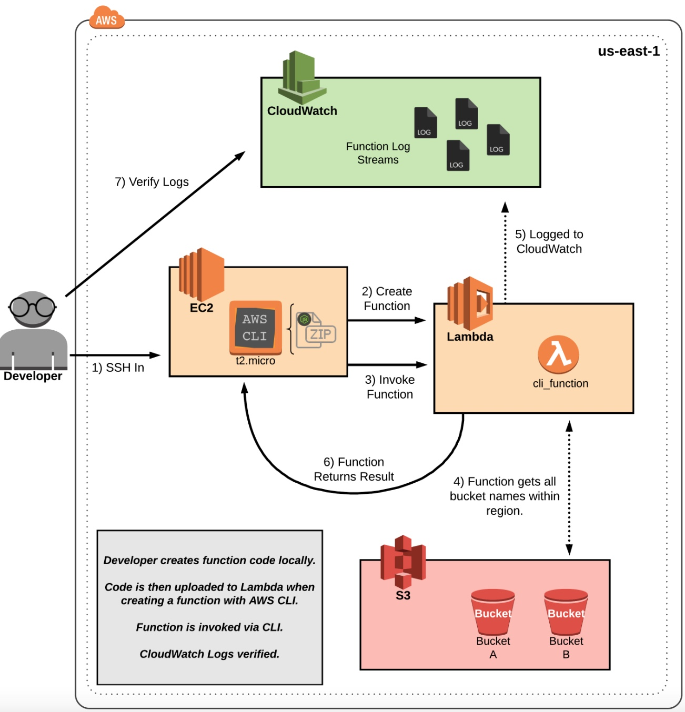

# Using the AWS CLI to Create an AWS Lambda Function


## Solution
## Create a Lambda Function Using the AWS CLI
1. Create the file:
```bash
vim lambda_function.js
```
2. Zip the file:
```bash
zip lambda_function.zip lambda_function.js
```
3. Create the Lambda function (replacing <ROLE ARN> with the IAM role ARN you copied in the AWS console earlier):
```bash
aws lambda create-function \
--region us-east-1 \
--function-name "ListS3Buckets" \
--runtime "nodejs12.x" \
--role "<ROLE ARN>" \
--handler "lambda_function.handler" \
--zip-file fileb:///home/cloud_user/lambda_function.zip
```
4. In the AWS console, navigate to Lambda > Functions. We should see the `ListS3Buckets` function we just created. Note its current description.
5. Now update the function:
```bash
aws lambda update-function-configuration \
--region us-east-1 \
--function-name "ListS3Buckets" \
--description "Creating our S3 function via CLI." \
--timeout 5 \
--memory-size 256
```

### Invoke Your Function Using AWS CLI
1. In the terminal, invoke the function:
```bash
aws lambda invoke \
--region us-east-1 \
--function-name "ListS3Buckets" OUTFILE.log
```