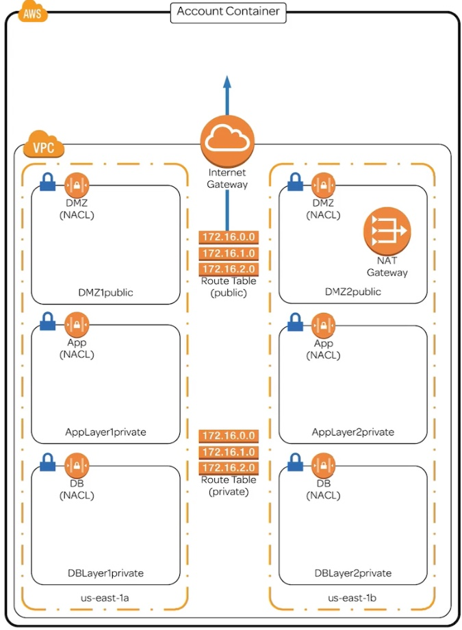
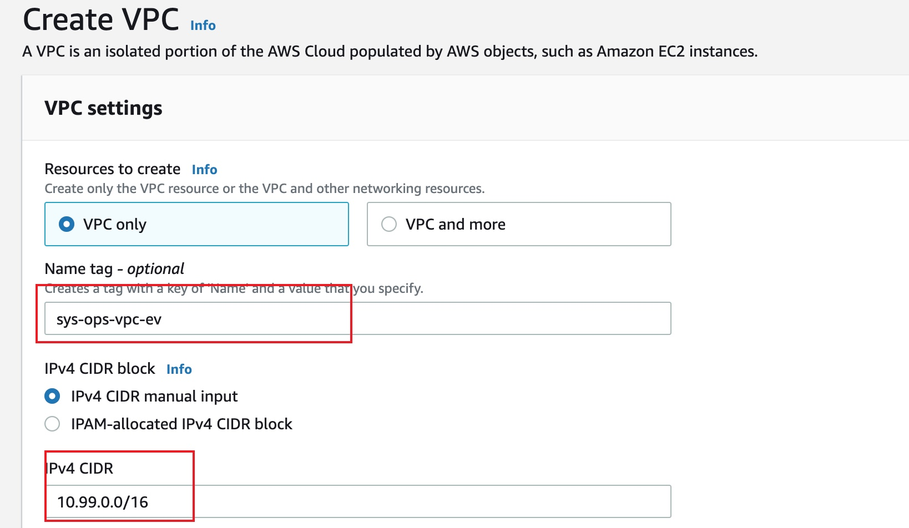
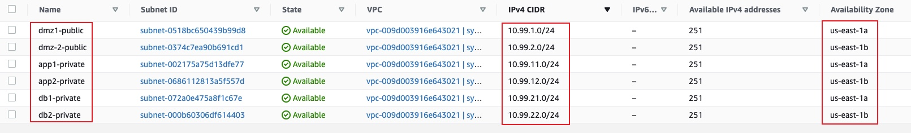
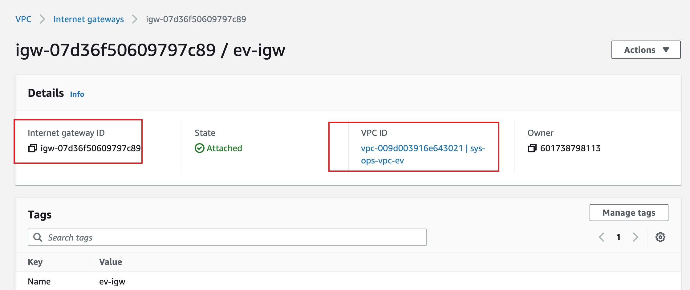
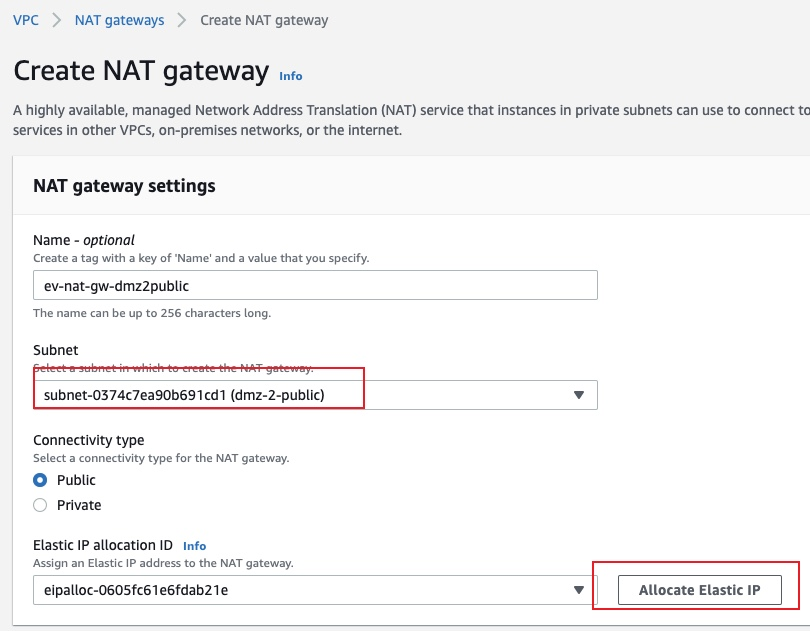
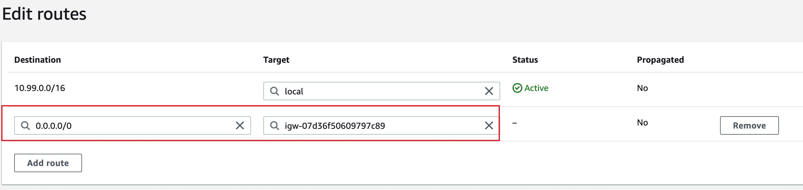
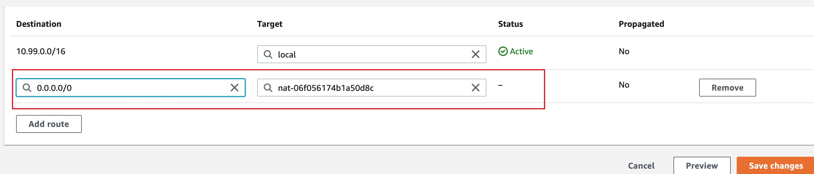
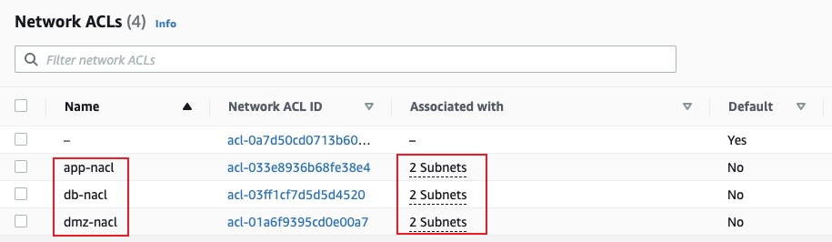

# Building a Three-Tier Network VPC from scratch
## Introduction
This lab provides you with the opportunity to get hands-on experience building and connecting the following components inside AWS:

- VPC
- Subnets
- Internet Gateway
- Route Tables
- Nat Gateway
- Network Access Control Lists (NACLs)
These components are the foundation of highly available/fault tolerant networking architecture inside of AWS, while covering concepts such as infrastrucutre, design, routing, and security.

## Solution
1. Create VPC

2. Create subnets

3. Create an internet gateway and attache to the VPC created before

4. Create a NAT Gateway and associate with the corresponding subnet

5. Create two route tables
* Point the public route table to the internet gateway

* Point the private route table to the NAT gateway

6. Associate the public and private subnets to the corresponding subnets
7. Create NACL and associate with subnets. You can add inbound and outbound rules to NACL to secure the subnets.

