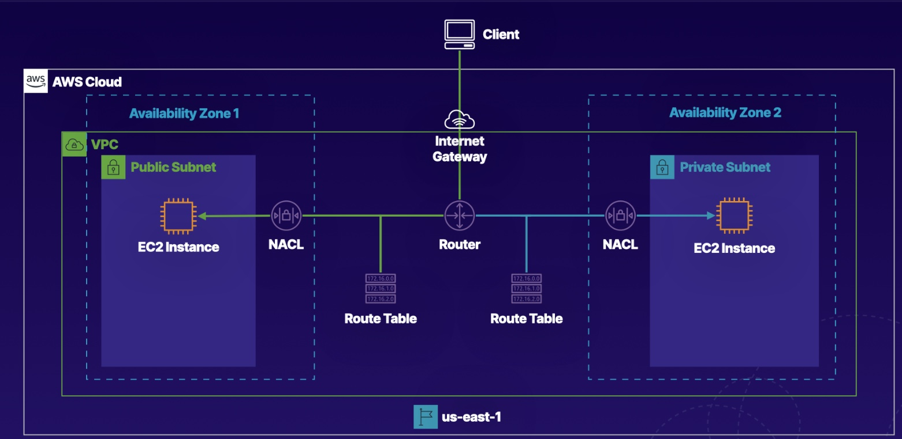

# Create a Basic VPC and Associated Components in AWS
## Introduction
The target is to setup a proper VPC that the instance inside the public subnet will be accessible from the internet.
We will
1. Create a VPC in one region
2. Attach a internet gateway to this VPC
3. Create two different subnets (public + private) in two different az
4. Attach a route table to the public subnet to include a route to the Internet gateway. The route table will also have an entry to allow the public subnet to communicate with the private subnet.
5. Update the NACL to ensure the traffic is allowed to flow into the public internet
6. Setup a second route table for the private subnet to allow it talk to the public subnet. But this route table will not have route to the internet gateway.

In this hands-on lab, we will create a VPC with an internet gateway, as well as create subnets across multiple Availability Zones.

## Solution
### Create a VPC
1. Navigate to the VPC dashboard.
2. Click Your VPCs in the left-hand menu.
3. Click Create VPC, and set the following values:
* Name tag: VPC1
* IPv4 CIDR block: 172.16.0.0/16
4. Leave the IPv6 CIDR block and Tenancy fields as their default values.
5. Click Create.

## Create an Internet Gateway, and Connect It to the VPC
1. Click Internet Gateways in the left-hand menu.
2. Click Create internet gateway.
3. Give it a Name tag of "IGW".
4. Click Create internet gateway.
5. Once it's created, click Actions > Attach to VPC.
6. In the Available VPCs dropdown, select our VPC1.
7. Click Attach internet gateway.

## Create a Public and Private Subnet in Different Availability Zones
### Create Public Subnet
1. Click Subnets in the left-hand menu.
2. Click Create subnet, and set the following values:
* Name tag: Public1
* VPC: VPC1
* Availability Zone: us-east-1a
* IPv4 CIDR block: 172.16.1.0/24
3. Click Create.
### Create Private Subnet
1. Click Create subnet, and set the following values:
* Name tag: Private1
* VPC: VPC1
* Availability Zone: us-east-1b
* IPv4 CIDR block: 172.16.2.0/24
2. Click Create.
## Create Two Route Tables, and Associate Them with the Correct Subnet
### Create and Configure Public Route Table
Note: The VPC has a default route table, but we will be creating custom route tables.
1. Click Route Tables in the left-hand menu.
2. Click Create route table, and set the following values:
* Name tag: PublicRT
* VPC: VPC1
3. Click Create.
4. With PublicRT selected, click the Routes tab on the page.
5. Click Edit routes.
6. Click Add route, and set the following values:
* Destination: 0.0.0.0/0
* Target: Internet Gateway > IGW
7. Click Save routes.
8. Select PublicRT, then click the Subnet Associations tab.
9. Click Edit subnet associations.
10. Select our Public1 subnet.
11. Click Save.
### Create and Configure Private Route Table
1. Click Create route table, and set the following values:
* Name tag: PrivateRT
* VPC: VPC1
2. Click Create.
3. Select PrivateRT, then click the Subnet Associations tab.
4. Click Edit subnet associations.
5. Select our Private1 subnet.
6. Click Save.
## Create Two Network Access Control Lists (NACLs), and Associate Each with the Proper Subnet
### Create and Configure Public NACL
1. Click Network ACLs in the left-hand menu.
2. Click Create network ACL, and set the following values:
* Name tag: Public_NACL
* VPC: VPC1
3. Click Create.
4. With Public_NACL selected, click the Inbound Rules tab below.
5. Click Edit inbound rules.
6. Click Add Rule, and set the following values:
* Rule #: 100
* Type: HTTP (80)
* Port Range: 80
* Source: 0.0.0.0/0
* Allow / Deny: ALLOW
7. Click Add Rule, and set the following values:
* Rule #: 110
* Type: SSH (22)
* Port Range: 22
* Source: 0.0.0.0/0
* Allow / Deny: ALLOW
8. Click Save.
9. Click the Outbound Rules tab.
10. Click Edit outbound rules.
11. Click Add Rule, and set the following values:
* Rule #: 100
* Type: Custom TCP Rule
* Port Range: 1024-65535
* Destination: 0.0.0.0/0
* Allow / Deny: ALLOW
12. Click Save.
13. Click the Subnet associations tab.
14. Click Edit subnet associations.
15. Select the Public1 subnet, and click Save changes.
### Create and Configure Private NACL
1. Click Create network ACL, and set the following values:
* Name tag: Private_NACL
* VPC: VPC1
* Click Create.
2. With Private_NACL selected, click the Inbound Rules tab below.
3. Click Edit inbound rules.
4. Click Add Rule, and set the following values:
* Rule #: 100
* Type: SSH (22)
* Port Range: 22
* Source: 172.16.1.0/24
* Allow / Deny: ALLOW
4. Click Save.
5. Click the Outbound Rules tab.
6. Click Edit outbound rules.
7. Click Add Rule, and set the following values:
* Rule #: 100
* Type: Custom TCP Rule
* Port Range: 1024-65535
* Destination: 0.0.0.0/0
* Allow / Deny: ALLOW
8. Click Save.
9. Click the Subnet associations tab.
10. Click Edit subnet associations.
11. Select the Private1 subnet, and click Save changes.
