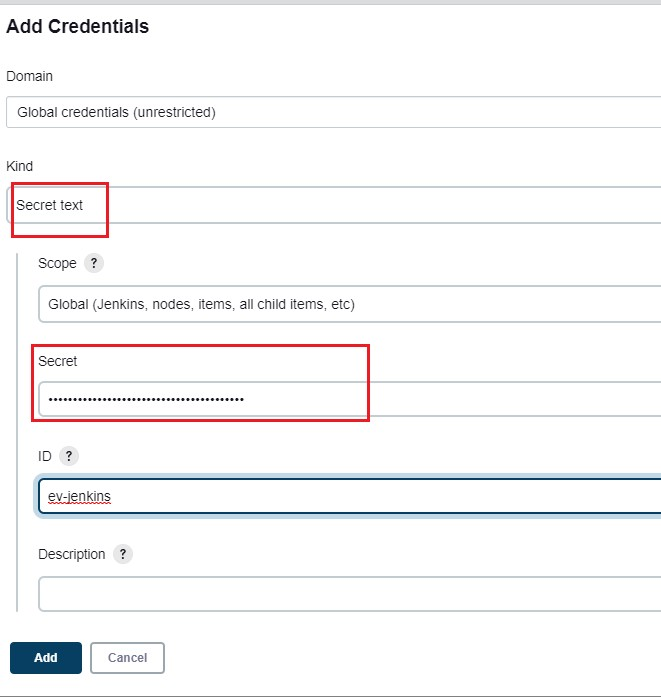
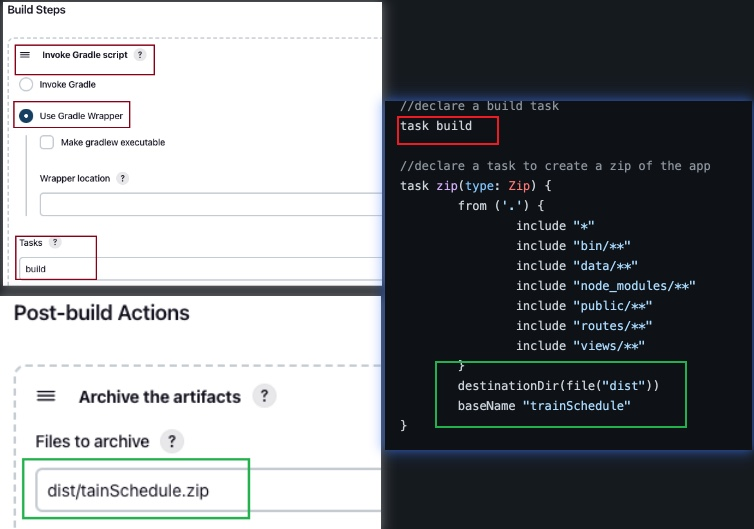

# Install and Configure Jenkins
## Install Jenkins
1. Start by importing the GPG key. The GPG key verifies package integrity but there is no output. Run:
```bash
curl -fsSL https://pkg.jenkins.io/debian-stable/jenkins.io.key | sudo tee /usr/share/keyrings/jenkins-keyring.asc > /dev/null
```
2. Add the Jenkins software repository to the source list and provide the authentication key:
```bash
echo deb [signed-by=/usr/share/keyrings/jenkins-keyring.asc] https://pkg.jenkins.io/debian-stable binary/ | sudo tee /etc/apt/sources.list.d/jenkins.list > /dev/null
```
3. Install Jenkins
```bash
sudo apt-get update
sudo apt install jenkins -y
```
4. Modify Firewall to Allow Jenkins
```bash
sudo ufw allow 8080
sudo ufw status

#Status: inactive
```
5. Access the UI via `<host-ip>:8080`

## Configure Jenkins
0. Generate a Personal access tokens from Github via `Settings -> Developer settings` with `admin:repo_hook` privilege.
1. Add the access token to Jenkins via In Manage-Jenkins -> Configure System

1. Create a new FreeStyle project in Jenkins, and paste the url of source code project to `Source Code Management`
2. Build Steps - Invoke Gradle script
- Check Use `Gradle Wrapper`
- Input the tasks name, as per `build.gradle` in the source code
3. Post-build Actions - Archive the artifacts


## Reference
- [How to Install Jenkins on Ubuntu 22.04](https://phoenixnap.com/kb/install-jenkins-ubuntu)
