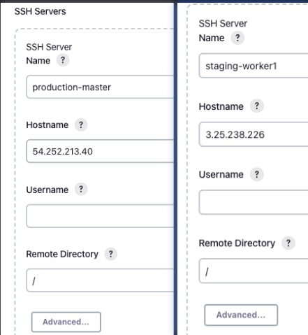
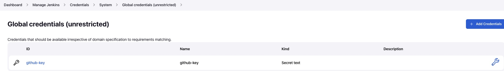
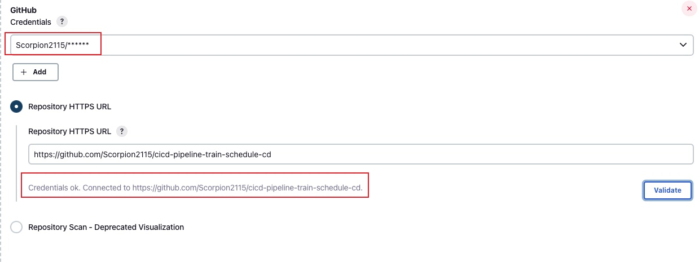

# Deployment with Jenkins Pipelines
## Install and Configure SSH plugin 
1. Install `Publish Over SSH` plugins via Manage Jenkins -> Plugin Manager
2. Configure Staging and Production servers

3. Setup Credentials (username and password) to allow Jenkins to logon the the servers as a qualified user.

## Setup the Pipeline
Create a Multibranch pipeline project
1. Add Github repo URL to the Branch Sources. Create credentials using github username and api token

## Reference
[jenkins:配置密钥时报错的解决：Failed to add SSH key. Message invalid privatekey](https://www.cnblogs.com/architectforest/p/13707244.html)

/etc/systemd/system/./train-schedule.service