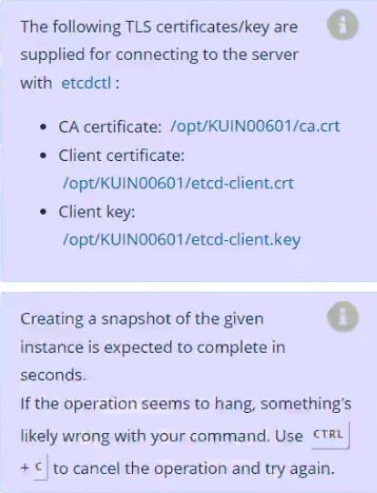

# Task
First, create a snapshot of the existing etcd instance running at `https://127.0.0.1:2379`, saving the snapshot to `/var/lib/backup/etcd-snapshot.db`.

Next, restore an existing, previous snapshot located at `/var/lib/backup/etcd-snapshot-previous.db`.


## Solution
1. Backup etcd to the specific directory
```bash
ETCDCTL_API=3 etcdctl --endpoints https://127.0.0.1:2379 \
  --cert=/opt/KUIN00601/etcd-client.crt \
  --key=/opt/KUIN00601/etcd-client.key \
  --cacert=/opt/KUIN00601/ca.crt \
  snapshot save /var/lib/backup/etcd-snapshot.db
```

2. Restore the etcd
```bash
ETCDCTL_API=3 etcdctl --endpoints 127.0.0.1:2379 \
snapshot restore /var/lib/backup/etcd-snapshot.db
```

3. Restart etcd:
```bash
sudo systemctl restart etcd
```