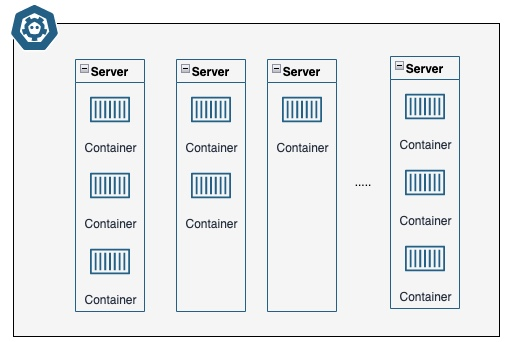

# Kubernetes basic
## What is kubernetes
Essentially, kubernetes is a powerful tool that help us to manage the containers
[What is kubernetes](https://kubernetes.io/docs/concepts/overview/what-is-kubernetes/)

## The kubernetes Cluster
Suppose we have several servers, each of them running multiple containers. Once we get a huge number of containers, to manage them could be pretty difficult.

Essentially, Kubernetes build up a layer of abstraction around of all that, known as `kubernetes clusters`

When you are using kubernetes, you don't need to think about what server you're going to run your container, kubernetes handle the process of running container for you.

## Key kubernetes Features
* Container Orchestration: dynamically manager containers across multiple host system
* Application Reliability: build reliable, self-healing, and scalable applications