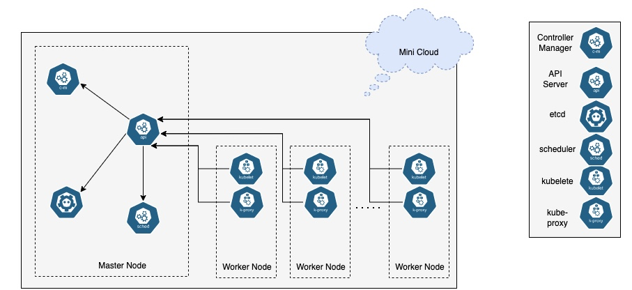

# Kubernetes Architecture Overview
## Kubernetes Control Plane
* `kube-apiserver`: expose the kubernetes API that allow user to interact with kubernetes cluster
* `etcd`: the backend data store for the kubernetes cluster
* `kube-scheduler`: handle scheduling, the process of selecting an available node in the cluster on which to run containers.
* `kube-controller-manager`: run controller process to control nodes, jobs, endpoints, service account in the cluster

## Kubernetes Nodes
* `kubelete`: a agent that runs on each node. It communicates with the control plane and makes sure that containers are running properly in a pod
* `kube-proxy`: a network proxy that run on each node to provide networking between containers and services in the cluster

## A Kubernetes Cluster
