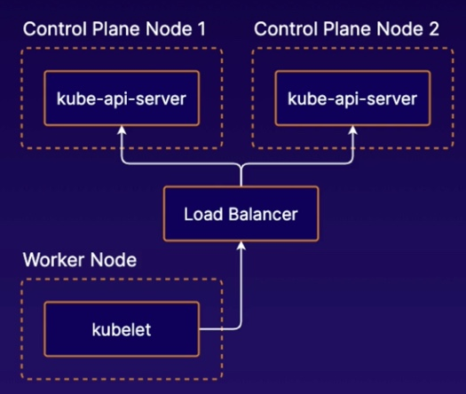
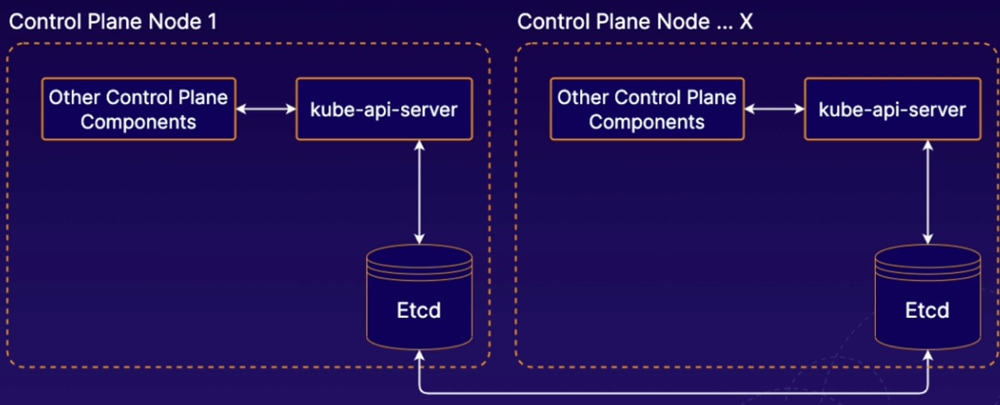
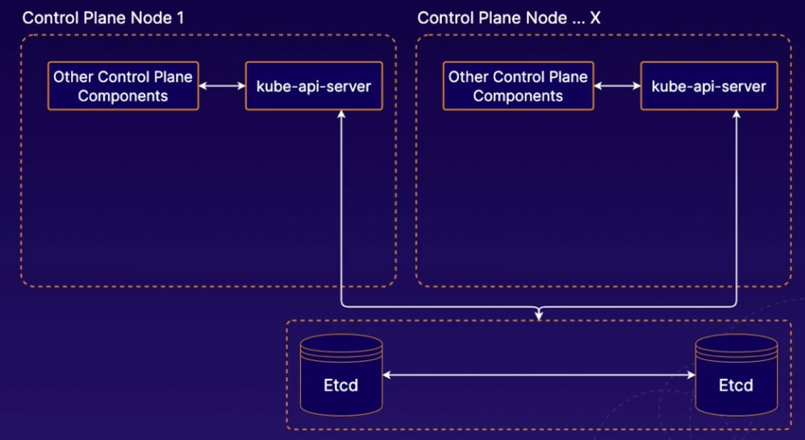

# Cluster Management

## High Availability in K8S
1. Multiple Control nodes
2. Communicate with the kubernetes API via `Load balancer`

## How to manage the etcd instance
1. stacked etcd: deploy etcd on the same node with the rest of control node components

2. external etcd: deploy etcd on a different server
