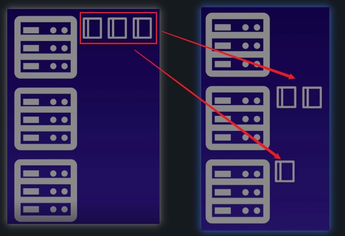

# Safely Draining a K8s Node
## What is draining?
When performance maintenance, you may sometimes need to remove a kubernetes node from service, without impacting on other nodes
When you drain a node, containers running on the node will be gracefully terminated (and potentially rescheduled on another node)


## Hands-on Demo
1. Create a pod
```yml
apiVersion: v1
kind: Pod
metadata:
  name: nginx
spec:
  containers:
  - name: nginx
    image: nginx:1.14.2
    ports:
    - containerPort: 80
```
2. Create a deployment with replicas
```yml
apiVersion: apps/v1
kind: Deployment
metadata:
  name: nginx-deployment
  labels:
    app: nginx
spec:
  replicas: 3
  selector:
    matchLabels:
      app: nginx
  template:
    metadata:
      labels:
        app: nginx
    spec:
      containers:
      - name: nginx
        image: nginx:1.14.2
        ports:
        - containerPort: 80
```

1. To remove a kubernetes node from service
```bash
kubectl drain <node name> --ignore-daemonsets
```
2. To add the node back to cluster
```bash
kubectl uncordon <node name>
```