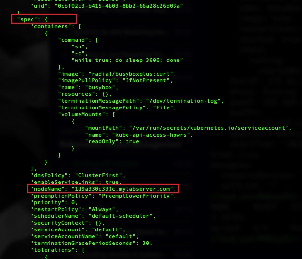
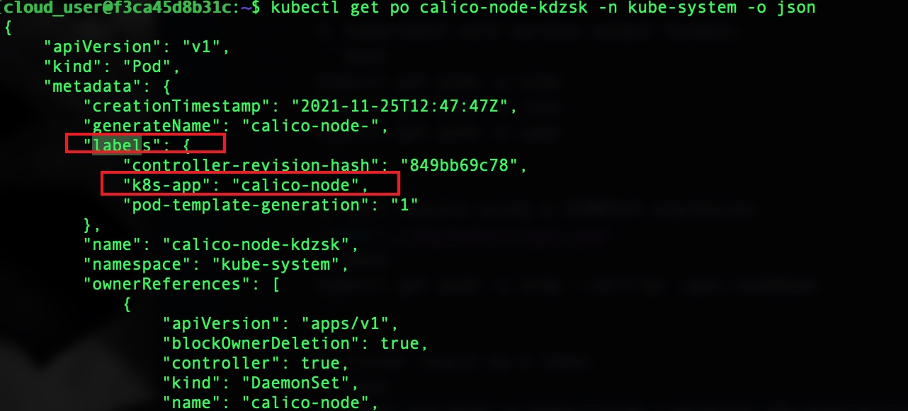

# Exploring a kubernetes cluster using kubectl

1. Create a pod
```bash
kubectl apply -f pod.yml
```

2.  Use "kubectl api-resources" for a complete list of supported resources.
```bash
kubectl api-resources
```

3. Experiment with various output formats.
```bash
kubectl get pods -o wide
kubectl get pods -o json
kubectl get pods -o yaml
```

4. Sort results using a JSONPath expression

```bash
kubectl get pods -o wide --sort-by .spec.nodeName
```

5. Filter result by a label

```bash
 kubectl get pods -n kube-system --selector k8s-app=calico-node
 ```

 6. Execute a command inside a pod.
 ```bash
 kubectl exec my-pod -c busybox -- echo "Hello, world!"

 kubectl exec my-pod -c busybox -n beebox-mobile -- cat /etc/key/key.txt > /home/cloud_user/key.txt
 ```