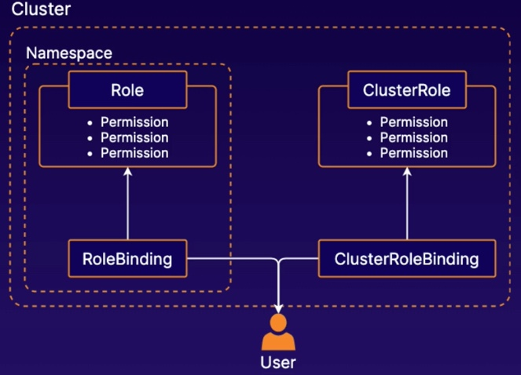

# Managing K8s Role-Based Access Control (RBAC)
RBAC allows you to control what users are allowed to do and access within your cluster.

For example, you can use RABC to allow developers to read metadata and logs from k8s pods but not make changes.

* `Roles`: defines permissions within a particular namespace
* `ClusterRoles`: defines cluster-wide permissions
* `RoleBinding`: connect users to Roles
* `ClusterRoleBinding`: connect users to ClusterRoles

[Using RBAC Authorization](https://kubernetes.io/docs/reference/access-authn-authz/rbac/)