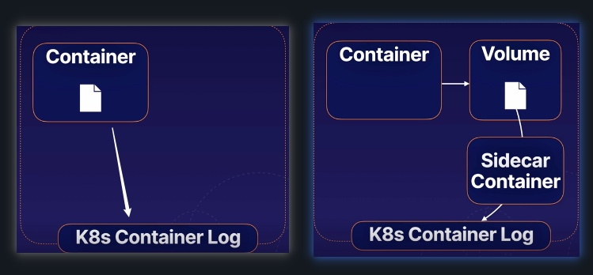

# Create Multi-container Pods

## What is a multi-container pod
A pod with more than one container is a multi-container pod

In a multi-container pod, the containers share resources such as network and storage. They can interact with one another.

## Cross-Container Interaction
* Network: containers can communicate with one another on any port, even if that port is not exposed to the cluster
* Storage: containers can use volume to share data in a pod

A typical use case:
You have an app that is hard-coded to write log to a file on the disk
To read the log files, you can add a secondary container (sometimes called a sidecar) that reads the log files from a share volume and prints it to the console, so that the log output will appear in the container log


`vi sidecar-pod.yml`
```yml
apiVersion: v1
kind: Pod
metadata:
  name: sidecar-pod
spec:
  containers:
  - name: busybox1
    image: busybox
    # every 5s, write a dummy value to mimic the log information
    command: ['sh', '-c', 'while true; do echo this is the logs data > /output/output.log; sleep 5; done']
    # mount the same volume to both containers, so it will allow both containers to interact with the same volume
    volumeMounts:
    - name: sharedvol
      mountPath: /output
  - name: sidecar
    image: busybox
    # read the log file
    command: ['sh', '-c', 'tail -f /input/output.log']
    volumeMounts:
    - name: sharedvol
      mountPath: /input
  volumes:
  - name: sharedvol
    emptyDir: {}
```

```bash
# deploy the multi-conatiner pod
kubectl apply -f sidecar-pod.yml

# query the log from the sidecar container and print the log message in the console
kubectl logs sidecar-pod -c sidecar

#this is the logs data
```