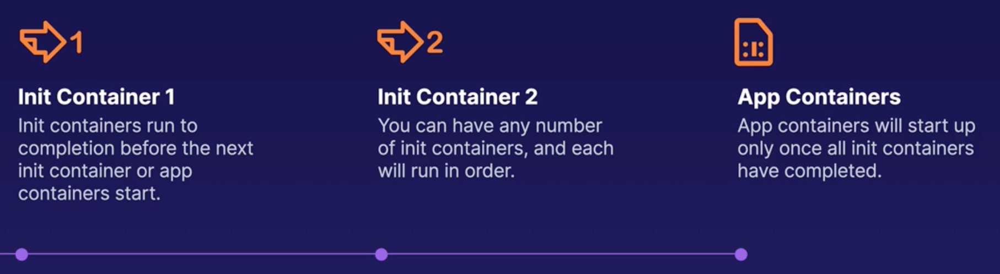

# Introducing Init Containers
## What are init containers
Init containers run once during the startup process of a pod. 

A pod can have any number of init containers, and they will each run once to completion.


You can use init containers to perform a variety of startup tasks.

You use init containers to offloading startup tasks to a separate container, thereby keeping the main containers ligher and more secure.


## Typical user cases
* Cause a pod to wait for another k8s resources to be created before finishing startup
* Perform sensitive startup setup securely outside of app containers 
* Populate data into a shared volume at startup 
* Communicate with another service startup
```yml
apiVersion: v1
kind: Pod
metadata:
  name: init-pod
spec:
  containers:
  - name: nginx
    image: nginx:1.19.1
  initContainers:
  - name: delay
    image: busybox
    command: ['sleep', '30']
```