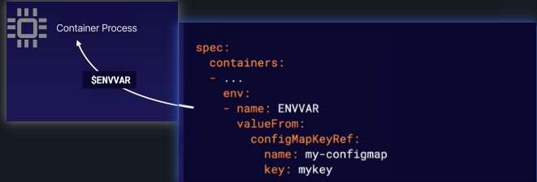

# Managing Application Configuration
When you are running applications in kubernetes, you may want to pass dynamic values to your applications at runtime to control how they behave. This is known as `application configuration`

## How to store configuration data
There are two primary ways to store configuration data in kubernetes:
* `ConfigMap`: tp store configuration
* `Secrets`: to store sensitive data

1. ConfigMap
```yml
apiVersion: v1
kind: ConfigMap
metadata:
  name: my-configmap
data:
  key1: Hello, world!
  key2: |
    Test
    multiple lines
    more lines
```
2. Secret
Get two base64-encoded values.
```bash
echo -n 'secret' | base64
# c2VjcmV0
echo -n 'anothersecret' | base64
# YW5vdGhlcnNlY3JldA==
```

```yml
apiVersion: v1
kind: Secret
metadata:
  name: my-secret
type: Opaque
data:
  #secretkey1: <base64 String 1>
  secretkey1: c2VjcmV0
  #secretkey2: <base64 String 2>
  secretkey2: YW5vdGhlcnNlY3JldA==
```

## How to pass ConfigMap and Secret to containers:
There are two ways to pass ConfigMap and Secret to containers:
* Environment variables
* Mounted volumes

1. Use Environment Variables

```yml
-----
apiVersion: v1
kind: Pod
metadata:
  name: env-pod
spec:
  containers:
  - name: busybox
    image: busybox
    command: ['sh', '-c', 'echo "configmap: $CONFIGMAPVAR secret: $SECRETVAR"']
    env:
    - name: CONFIGMAPVAR
      valueFrom:
        configMapKeyRef:
          name: my-configmap
          key: key1
    - name: SECRETVAR
      valueFrom:
        secretKeyRef:
          name: my-secret
          key: secretkey1        
```
2. Use Volume Mount
```yml      
apiVersion: v1
kind: Pod
metadata:
  name: volume-pod
spec:
  containers:
  - name: ubuntu
    image: ubuntu:latest
    command: ["/bin/sleep", "3650d"]
    #command: ['sh','-c', 'while true; do sleep 3600; done']
    volumeMounts:
    - name: configmap-volume
      mountPath: /etc/config/configmap
    - name: secret-volume
      mountPath: /etc/config/secret
  volumes:
  - name: configmap-volume
    configMap:
      name: my-configmap
  - name: secret-volume
    secret:
      secretName: my-secret
```
Check the log for the env pod to see your configuration values!

```bash
 kubectl logs env-pod
 # configmap: Hello, world! secret: secret
```
Use `kubectl exec` to navigate inside the pod and see your mounted config data files.
```bash
kubectl exec volume-pod -- ls /etc/config/configmap

kubectl exec volume-pod -- cat /etc/config/configmap/key1 

kubectl exec volume-pod -- cat /etc/config/configmap/key2 

kubectl exec volume-pod -- ls /etc/config/secret

kubectl exec volume-pod -- cat /etc/config/secret/secretkey1 

kubectl exec volume-pod -- cat /etc/config/secret/secretkey2
```