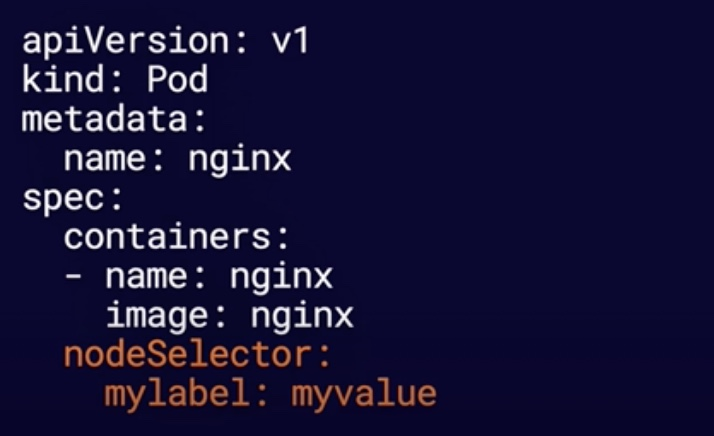
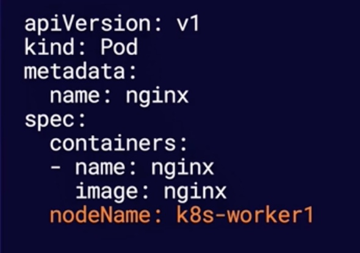

# Exploring k8s scheduling
## What is Scheduling
`Scheduling `is the process of assigning pods to nodes so that kubelet can run them.


## Scheduling Process
The `Scheduler`, as a control plane component, handles the scheduling process to select a suitable node for each pod. The scheduler considers:
* Resource requests vs available node resources
* Various configurations that affect scheduling using `node selector`

## nodeSelector
You can configure a nodeSelector for your pods to limit which Node(s) the Pod can be scheduled on.

Node selector use node labels to filter suitable nodes.

The below example tells the scheduler, only the nodes that have `mylabel` with value `myvalue` are eligible to run this pod



## nodeName
You can bypass scheduling and assign a Pod to a specific node by name using `nodeName`.

The example below tells the schedule to assign this pod to the node named `k8s-worker1`


## Hands-on
1. Add label to one of the worker nodes
```bash
kubectl label nodes <node name> special=true
```
2. View the labels
```bash
kubectl get nodes --show-labels

NAME                           STATUS   ROLES                  AGE    VERSION   LABELS
5dad3b3c453c.mylabserver.com   Ready    <none>                 5d1h   v1.23.0   xxx,special=true,xxx
cloud_user@5dad3b3c451c:~$ 
```

3. Create a pod that uses a `nodeSelector` to filter which nodes it can run on using labels.
`vi nodeselector-pod.yml`
```yml
apiVersion: v1
kind: Pod
metadata:
  name: nodeselector-pod
spec:
  nodeSelector:
    special: "true"
  containers:
  - name: nginx
    image: nginx
```

4. Create a pod that uses nodeName to bypass scheduling and run on a specific node.
`vi nodename-pod.yml`
```yml
apiVersion: v1
kind: Pod
metadata:
  name: nodename-pod
spec:
  nodeName: 5dad3b3c452c.mylabserver.com 
  containers:
  - name: nginx
    image: nginx
```
5. Verify if the pod is run on the desired nodes 
```bash
kubectl get po -o wide

NAME                   READY   STATUS             RESTARTS        AGE     IP               NODE                           NOMINATED NODE   READINESS GATES
nodename-pod           1/1     Running            0               15s     192.168.16.84    5dad3b3c452c.mylabserver.com   <none>           <none>
nodeselector-pod       1/1     Running            0               4m13s   192.168.102.16   5dad3b3c453c.mylabserver.com   <none>           <none>
```