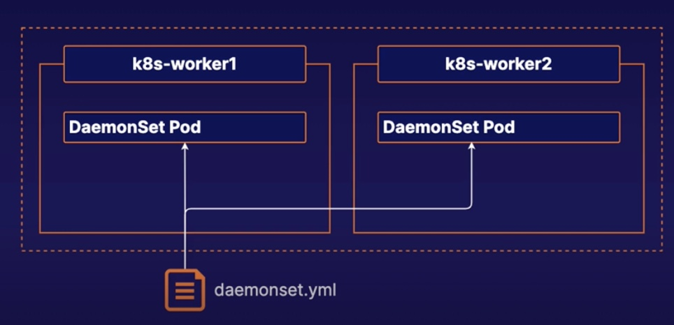

# Using DaemonSets
## What is a DaemonSet
DaemonSet automatically run a copy of a Pod on:
* Each existing node
* Any new node when it is added to the cluster

DaemonSets respect normal scheduling rules around node labels, taints and tolerations. 

If a pod would not normally be scheduled on a node, a DaemonSet will not create a copy of the pod on that Node.



## Demo
Create a DaemonSet descriptor
`vi my-daemonset.yml`

```yml
apiVersion: apps/v1
kind: DaemonSet
metadata:
  name: my-daemonset
spec:
  selector:
    matchLabels:
      app: my-daemonset
  template:
    metadata:
      labels:
        app: my-daemonset
    spec:
      containers:
      - name: nginx
        image: nginx:1.19.1
```
2. Create the DaemonSet in the cluster.
`kubectl apply -f my-daemonset.yml`

3. Get a list of pods, and verify that a DaemonSet pod is running on each worker node.
`kubectl get pods -o wide`