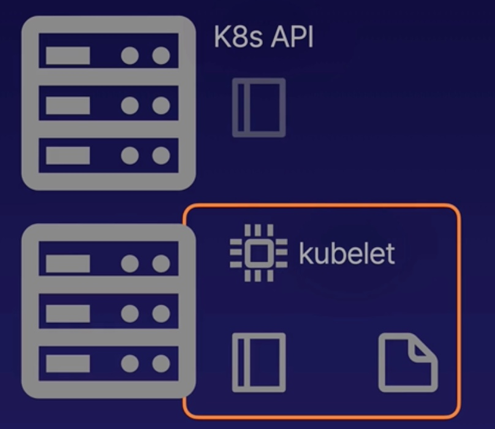

# Using Static Pods
## What is a static Pod
A static Pod is managed directly but the kubelet on a node, not by the k8s API server. They can run even if there is no k8s API server present.

kubelet automatically create static Pods from yaml manifest files located in the manifest path (`/etc/kubernetes/manifests/xxx.yml`)on the node.

## Mirror Pods
Kubelet will create a mirror Pod for each static Pod. Mirror Pods allow you to see the status of the static pod via the k8s API, but you cannnot change or manage them via API.



## Demo
1. Create a static pod manifest in the default manifest path.
`sudo vi /etc/kubernetes/manifests/my-static-pod.yml`

```yml
apiVersion: v1
kind: Pod
metadata:
  name: my-static-pod
spec:
  containers:
  - name: nginx
    image: nginx:1.19.1
```

2. Restart kubelet to start the static pod.
`sudo systemctl restart kubelet`

3. Because of the mirror pod, you can view and check the status of the static pod.
`kubectl get pods`

4. If you try attempt to delete the static Pod using the k8s API. The Pod will be immediately re-created, since it is only a mirror Pod created by the worker kubelet to represent the static Pod.
`kubectl delete pod my-static-pod-<worker node name>`
