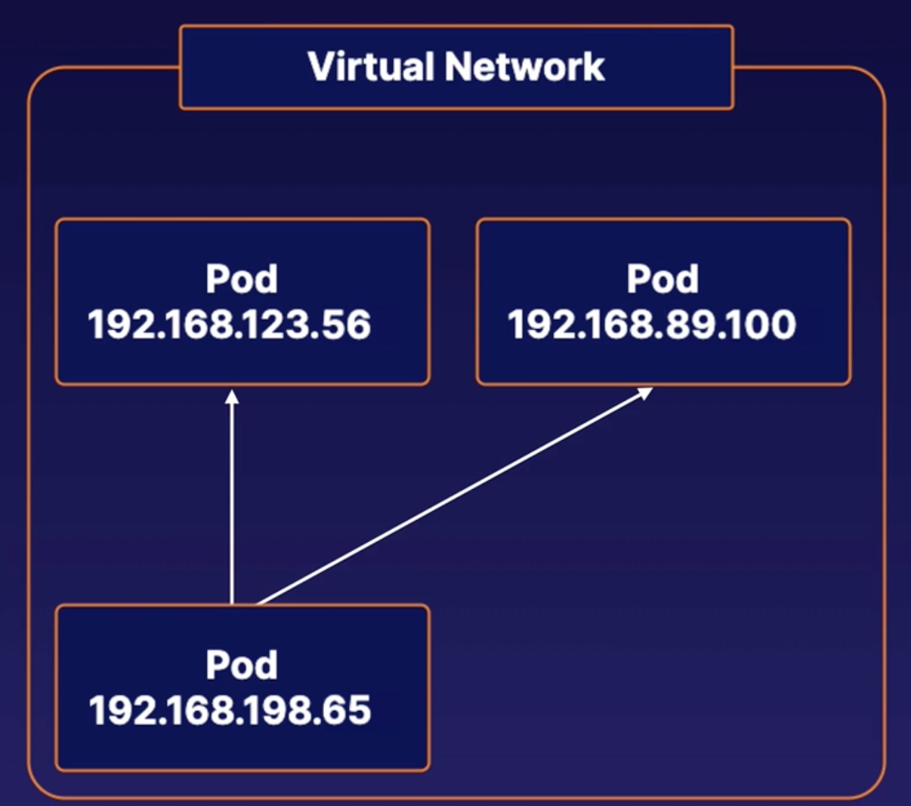

# K8s Networking Architecture Overview
## K8s network model
The K8s network model is a set of standards that define how networking between pods behaves

## Network model architecture
Each pod has its own `unique IP address` within the cluster

This creates a `virtual network`, where any pod can reach each other using the Pod's IP address, regardless of which node they are on

## CNI Plugins Overview
A type of k8s network plugins that provide network connectivity between pods