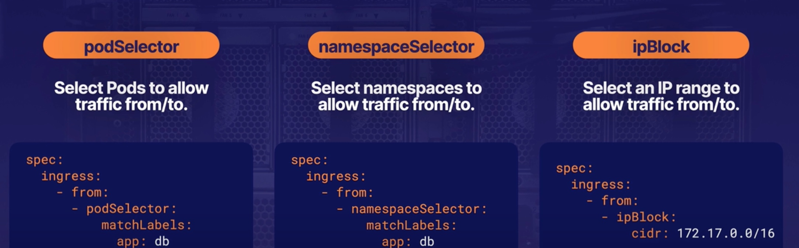

# Using Network Policies
## What is a NetworkPolicy
An object that allows you to control the flow of network communication to and form pods

This allows you to build a more secure cluster network by isolation pods from the traffic they do not need

## Pod Selector
Determines to which pods in the namespace the network policy applies

The podSelector can select pods using pod labels

By default, pods are considered non-isolated and completely open to all communication. If any network policy selects a pod, the pod is considered isolated and will only be open to traffic allowed by such a network policy

## Ingress and Egress
A network policy can apply to ingress, egress or both
`ingress`: incoming network traffic coming into the Pod from another source
`egress`: outgoing network traffic leaving the pod for another destination

## from and to Selectors
`from selector`: selects ingress traffic that will be allowed
`to selector`: selects egress traffic that will be allowed

There are multiple selector type we can use:
* podSelector
* namespaceSelector
* ipBlock

## Ports
Specifics one or more ports that will allow traffic