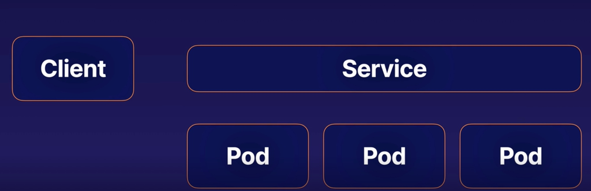
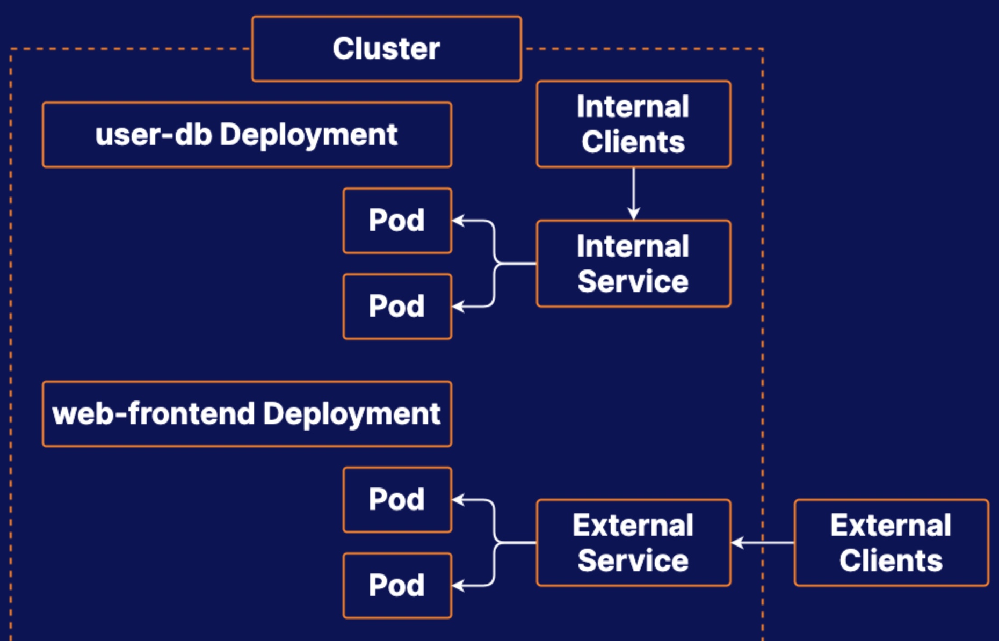

# K8s services overview
## What is a Service
kubernetes services provide a way to expose an application running as a sets of pods

## Service Routing
Whenever clients make requests to a service, the service  routes traffic to its pods in a load-balanced fashion

* The client does not need to think about which pod it is communicating to
* The client might not be aware of the fact that there are multiple pods.

## Endpoints
Endpoints are the backend entities to which service route traffic.

For a service that routes traffic to multiple pods, each pods will have an endpoint associated with the service

