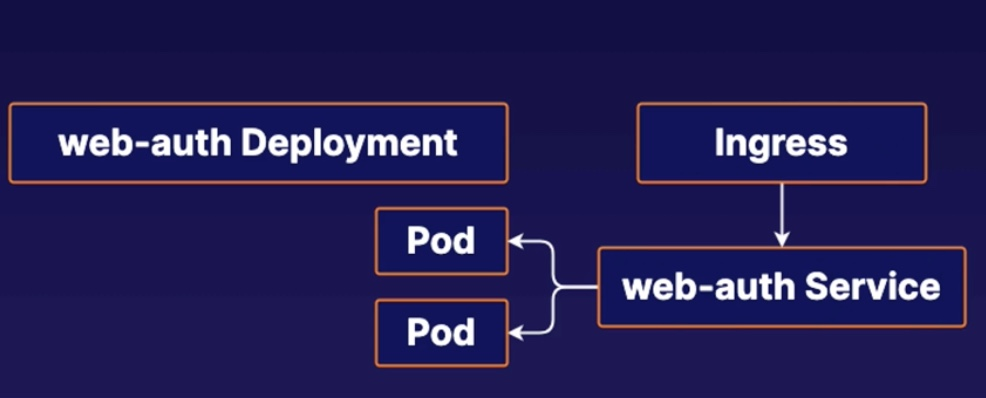

# Managing Access from Outside with K8s Ingress

## Inspect the Deployment
```bash
kubectl get deployment web-auth -o yaml|label

      {"apiVersion":"apps/v1","kind":"Deployment","metadata":{"annotations":{},"name":"web-auth","namespace":"default"},"spec":{"replicas":2,"selector":{"matchLabels":{"app":"web-auth"}},"template":{"metadata":{"labels":{"app":"web-auth"}},"spec":{"containers":[{"image":"nginx:1.19.1","name":"nginx","ports":[{"containerPort":80}]}]}}}}
      labels:
```
Learnt from the label, we shall use `app:web-auth` as the selector in the service.yml file.
```yml
...
  selector:
    app: web-auth
...    
```
## Create a Service to Expose the web-auth deployment
```bash
vi web-auth-svc.yml

kubectl apply -f web-auth-svc.yml
```


## Create an ingress that maps to a Service.
```bash
vi web-auth-ingress.yml

sudo kubectl apply -f web-auth-ingress.yml
```

To verify the ingress
```bash
kubectl describe ingress my-ingress
Name:             my-ingress
Labels:           <none>
Namespace:        default
Address:          
Default backend:  default-http-backend:80 (<error: endpoints "default-http-backend" not found>)
Rules:
  Host        Path  Backends
  ----        ----  --------
  *           
              /somepath   svc-clusterip:80 (192.168.102.9:80,192.168.16.78:80,192.168.16.83:80)
Annotations:  <none>
Events:       <none>
```

## Create an ingress that maps to a Service using name port
```bash
sudo vi svc-clusterip-name-port.yml

sudo vi my-ingress-name-port.yml

sudo kubectl apply -f svc-clusterip-name-port.yml
```

To verify
```bash
kubectl describe ingress my-ingress-name-port
Name:             my-ingress-name-port
Labels:           <none>
Namespace:        default
Address:          
Default backend:  default-http-backend:80 (<error: endpoints "default-http-backend" not found>)
Rules:
  Host        Path  Backends
  ----        ----  --------
  *           
              /somepath   svc-clusterip:you-know-who (192.168.102.9:80,192.168.16.78:80,192.168.16.83:80)
Annotations:  <none>
Events:       <none>
```

## Install NGINX Ingress Controller
```bash
kubectl apply -f https://raw.githubusercontent.com/kubernetes/ingress-nginx/controller-v1.2.0/deploy/static/provider/cloud/deploy.yaml

kubectl get pods --namespace=ingress-nginx
```
### local testing
```bash
kubectl apply -f ingress-demo.yml -f ingress-demo-svc.yml -f ingress-localhost.yml

kubectl port-forward --namespace=ingress-nginx service/ingress-nginx-controller 8080:80

# open up another host
curl http://demo.localdev.me:8080/
<html><body><h1>It works!</h1></body></html>
```

## Reference
[NGINX Ingress Controller](https://kubernetes.github.io/ingress-nginx/deploy/)